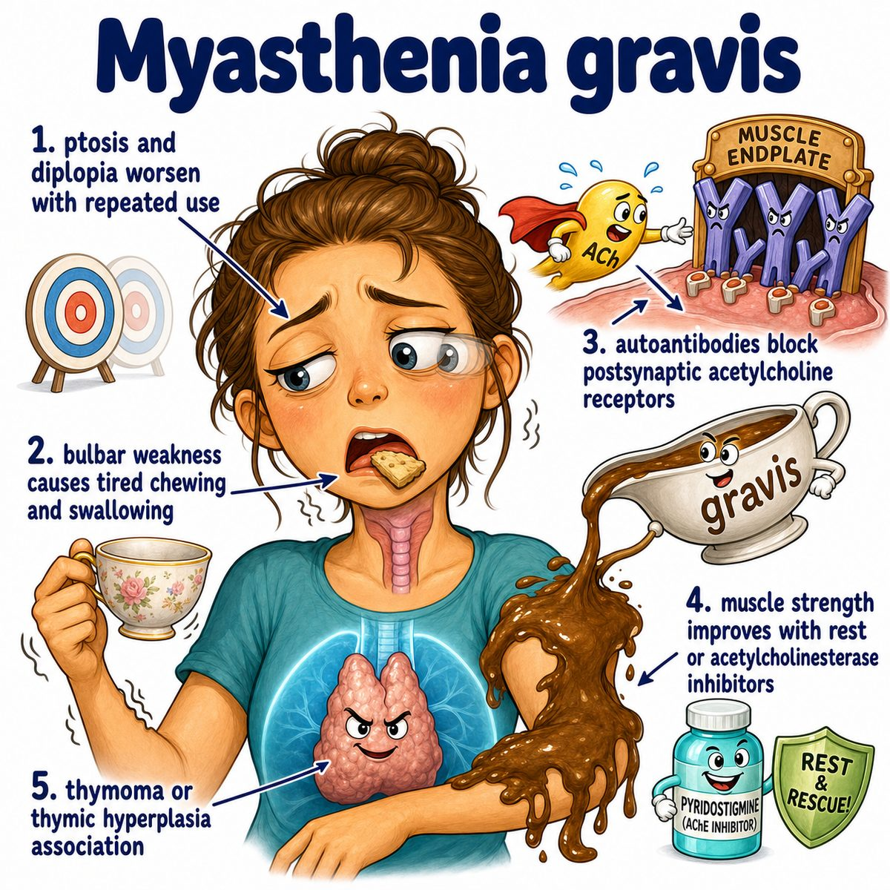

# Myasthenia gravis

### Core idea

Myasthenia gravis (MG) is an autoimmune disease where antibodies attack the neuromuscular junction (NMJ, the place where a nerve tells a muscle to contract).

Most commonly, antibodies target acetylcholine receptors (AChRs, receptors for acetylcholine on muscle).

So the nerve releases acetylcholine (ACh, the neurotransmitter that tells skeletal muscle to contract), but the muscle cannot hear the signal well.

---

### Why weakness happens

Normally:

* nerve releases ACh
* ACh binds AChRs on muscle
* muscle contracts

In MG:

* antibodies block or destroy AChRs
* fewer working receptors means weaker muscle activation
* repeated use makes symptoms worse because the already-limited signal gets depleted

That is why MG causes fatigable weakness, meaning weakness that worsens with use and improves with rest.

---

### Classic findings

* ptosis (drooping eyelid)
* diplopia (double vision)
* difficulty chewing or swallowing
* proximal muscle weakness (weakness closer to the trunk, like shoulders/hips)
* worse symptoms at the end of the day

Reflexes and sensation are usually normal because MG is a problem with nerve-to-muscle signaling, not the sensory nerves or spinal reflex arc.

---

### Important association

MG is associated with thymic abnormalities:

* thymic hyperplasia
* thymoma (tumor of the thymus)

The thymus is involved in T cell education, so abnormal thymic immune activity can promote autoantibodies against AChRs.

---

### Treatment logic

Pyridostigmine is an acetylcholinesterase inhibitor (drug that blocks breakdown of acetylcholine).

So it increases ACh in the synapse, giving the remaining AChRs more chances to get activated.

---

## One-line intuition

The nerve is yelling the command, but the muscle has fewer working receivers, so contraction becomes weak and fatigable.

---

## Pearl

Myasthenia gravis gets worse with repeated use, while Lambert-Eaton myasthenic syndrome (LEMS, autoimmune attack on presynaptic calcium channels) often improves with repeated use.