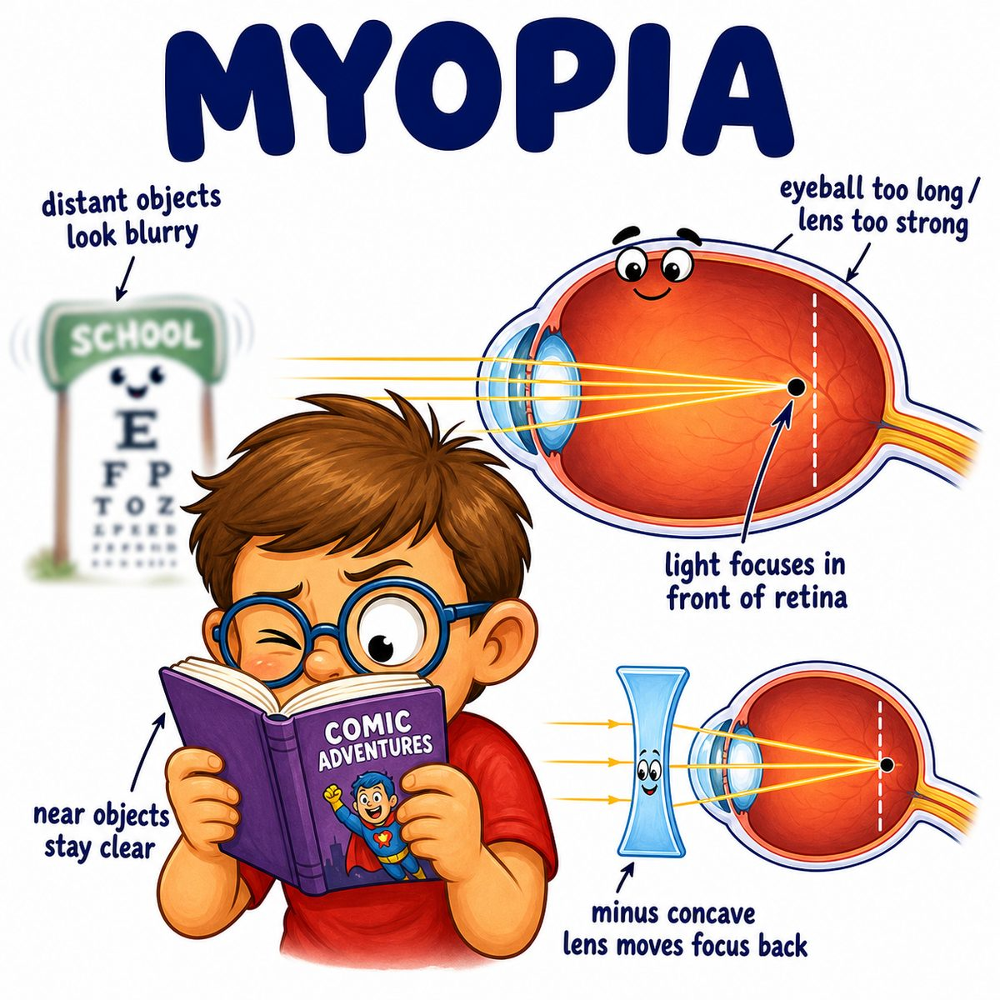

# Myopia

Myopia = nearsightedness.

That means:

* near objects look clear
* far objects look blurry

---

### Core idea

In myopia, light focuses **in front of the retina** instead of directly on the retina.

Retina = the light-sensitive layer in the back of the eye.

So the image is “too early” compared with where the retina actually is.

---

### Why it happens

Usually the eyeball is too long from front to back.

So when light enters the eye:

* cornea/lens bend the light
* light converges too soon
* focus lands in front of the retina
* by the time light reaches the retina, it is spreading out again
* result = blurry distance vision

---

### Why near vision is okay

Near objects send light rays that are already more spread out.

In a myopic eye, those spread-out rays can still focus on the retina pretty well.

That is why myopia = “I can see close, but not far.”

---

### Correction

Myopia is corrected with a **concave/diverging lens**.

Concave lens = a lens that spreads light rays out before they enter the eye.

This pushes the focal point backward onto the retina.

---

## One-line intuition

The myopic eye is too “long/strong,” so light focuses too early, in front of the retina.

---

## Pearl 🔥

Myopia is associated with increased risk of **retinal detachment** because an elongated eyeball can stretch/thin the retina.