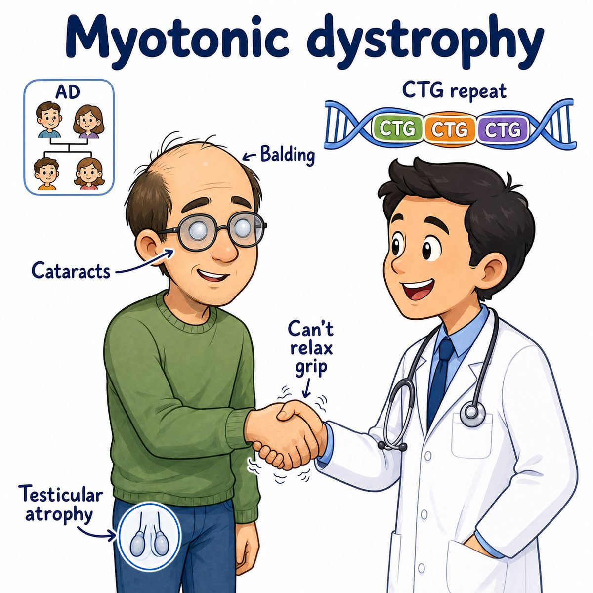

# Myotonic dystrophy

Myotonic dystrophy is an autosomal dominant (one mutated copy is enough) muscular dystrophy (inherited muscle-wasting disease) where the key problem is:

* muscle weakness
* myotonia (delayed muscle relaxation after contraction)
* cataracts
* cardiac conduction defects (problems with electrical signaling in the heart)
* endocrine issues like insulin resistance and testicular atrophy

Classic Step 1 version usually means **DM1 (myotonic dystrophy type 1)**.

---

### Core idea

The muscle can contract, but it has trouble relaxing.

Example:

* patient shakes your hand
* then cannot release grip quickly

That delayed relaxation = **myotonia**.

---

### Cause

DM1 is caused by a **CTG trinucleotide repeat expansion** in the **DMPK gene**.

Break that down:

* CTG = cytosine-thymine-guanine DNA repeat
* trinucleotide repeat = 3 DNA bases repeated over and over
* DMPK = dystrophia myotonica protein kinase gene

More repeats generally means worse disease.

---

### Why the symptoms happen

The expanded CTG repeat makes abnormal RNA (ribonucleic acid).

That abnormal RNA traps splicing proteins.

Splicing = editing pre-mRNA (pre-messenger RNA) into mature mRNA before making protein.

So the problem is not just "bad muscle protein."

It is more like:

> toxic RNA messes up splicing in many tissues.

That explains why myotonic dystrophy affects more than muscle:

* skeletal muscle → weakness + myotonia
* lens of eye → cataracts
* heart conduction system → arrhythmias (abnormal heart rhythms)
* endocrine organs → insulin resistance, testicular atrophy
* face/scalp muscles → facial wasting, ptosis (droopy eyelids), frontal balding

---

### Classic findings

Think:

* weak grip with delayed release
* distal muscle weakness (hands/feet more than shoulders/hips in DM1)
* facial wasting
* frontal balding
* cataracts
* testicular atrophy
* conduction defects on ECG (electrocardiogram)

---

## One-line intuition

Myotonic dystrophy is a CTG repeat disease where toxic RNA causes bad splicing, so muscles become weak and slow to relax, while eyes, heart, and endocrine organs also get involved.

---

## Pearl 🔥

Myotonic dystrophy shows **anticipation**, meaning symptoms get earlier and more severe in later generations because the CTG repeat expands during transmission.