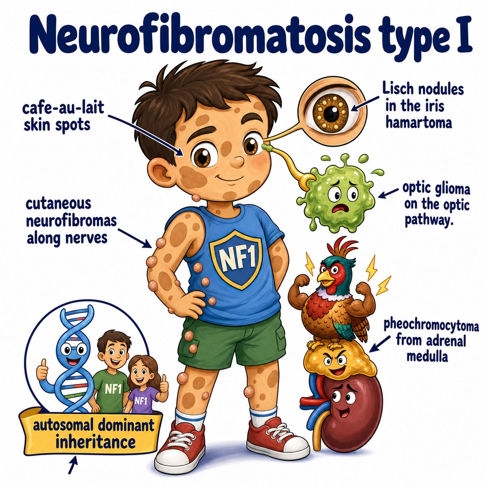

# Neurofibromatosis

Neurofibromatosis is an autosomal dominant genetic disorder where nerve-related cells form tumors.

Autosomal dominant means:

* one bad copy of the gene is enough to cause disease

Main Step 1 types:

* NF1 (neurofibromatosis type 1)
* NF2 (neurofibromatosis type 2)

---

### NF1

NF1 is the classic one with skin findings.

Caused by mutation on:

* chromosome 17
* NF1 gene
* neurofibromin loss

Neurofibromin normally inhibits RAS (a growth signaling protein).

So if neurofibromin is lost:

* RAS signaling increases
* cells grow too much
* benign nerve sheath tumors form

Classic findings:

* cafe-au-lait spots
* axillary freckling
* neurofibromas
* Lisch nodules
* optic gliomas
* pheochromocytoma

Lisch nodules are pigmented iris hamartomas.

Hamartoma means a benign overgrowth of normal tissue in the wrong amount/organization.

---

### NF2

NF2 is more about central nervous system tumors.

Caused by mutation on:

* chromosome 22
* NF2 gene
* merlin loss

Merlin is a tumor suppressor protein, meaning it normally helps stop excess cell growth.

Classic finding:

* bilateral vestibular schwannomas

Vestibular schwannomas are tumors of Schwann cells on cranial nerve 8, the vestibulocochlear nerve.

That causes:

* hearing loss
* tinnitus
* balance problems

Also associated with:

* meningiomas
* ependymomas

---

## One-line intuition

Neurofibromatosis = broken tumor suppression in nerve-related tissue, so patients grow nerve sheath tumors plus characteristic skin/eye findings.

---

## Pearl

NF1 = chromosome 17 = neurofibromin = cafe-au-lait spots, neurofibromas, Lisch nodules.

NF2 = chromosome 22 = merlin = bilateral vestibular schwannomas.