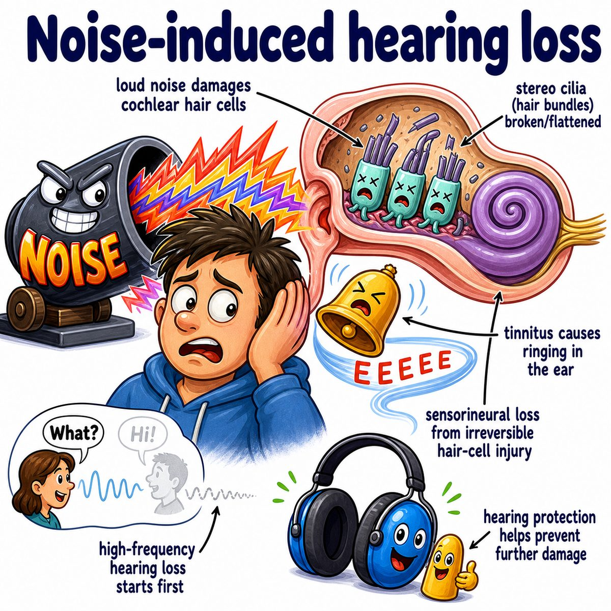

# Noise-induced hearing loss

Noise-induced hearing loss means hearing loss caused by loud sound damaging the inner ear.

More specifically, it is usually **sensorineural hearing loss**:

* sensory = cochlear hair cells are damaged
* neural = the auditory nerve pathway can be affected
* hearing loss = sound signal does not reach the brain normally

The key structure is the **cochlea**, the spiral-shaped inner ear organ that converts sound vibrations into electrical nerve signals.

---

### Core idea

Loud noise physically and metabolically injures the tiny hair cells in the cochlea.

These hair cells have small projections called **stereocilia**.

Stereocilia bend when sound waves enter the ear.

That bending normally opens ion channels, which helps create an electrical signal that travels through CN VIII (cranial nerve 8, the vestibulocochlear nerve) to the brain.

If loud noise damages those stereocilia:

* they cannot bend/respond normally
* the signal to the brain is weaker or distorted
* hearing becomes muffled
* speech can become hard to understand, especially with background noise

---

### Why it is often permanent

In humans, cochlear hair cells do not regenerate well.

So once enough hair cells are destroyed, the ear cannot simply “grow them back.”

That is why noise-induced hearing loss is usually permanent.

---

### Why high frequencies go first

Noise damage classically affects high-frequency hearing.

Reason:

* high-frequency sounds are detected near the base of the cochlea
* the base gets hit early by incoming sound energy
* those hair cells are especially vulnerable to repeated loud noise

So patients may first have trouble hearing high-pitched consonants like:

* “s”
* “f”
* “t”
* “th”

This makes speech sound unclear even if the person can still hear that someone is talking.

---

### Audiogram pattern

Classic finding:

* **4 kHz notch**

An audiogram is a hearing test graph.

A “notch” means hearing is worse at a specific frequency, then partly improves at nearby frequencies.

For noise-induced hearing loss, the dip is often around 3,000-6,000 Hz, especially about 4,000 Hz.

---

### Risk depends on 3 things

Noise damage depends on:

* loudness, measured in dB (decibels)
* duration, meaning how long the exposure lasts
* distance from the sound source

Very loud sound can injure the ear quickly.

Less extreme sound can still injure the ear if exposure is repeated for a long time.

---

## One-line intuition

Noise-induced hearing loss is basically: loud sound breaks the cochlea’s tiny sound-sensing hair cells, so the ear cannot convert vibrations into clean nerve signals anymore.

---

## HY Step 1 pearl

Noise-induced hearing loss is a **sensorineural hearing loss** with a classic **4 kHz notch** on audiogram due to cochlear hair cell damage.