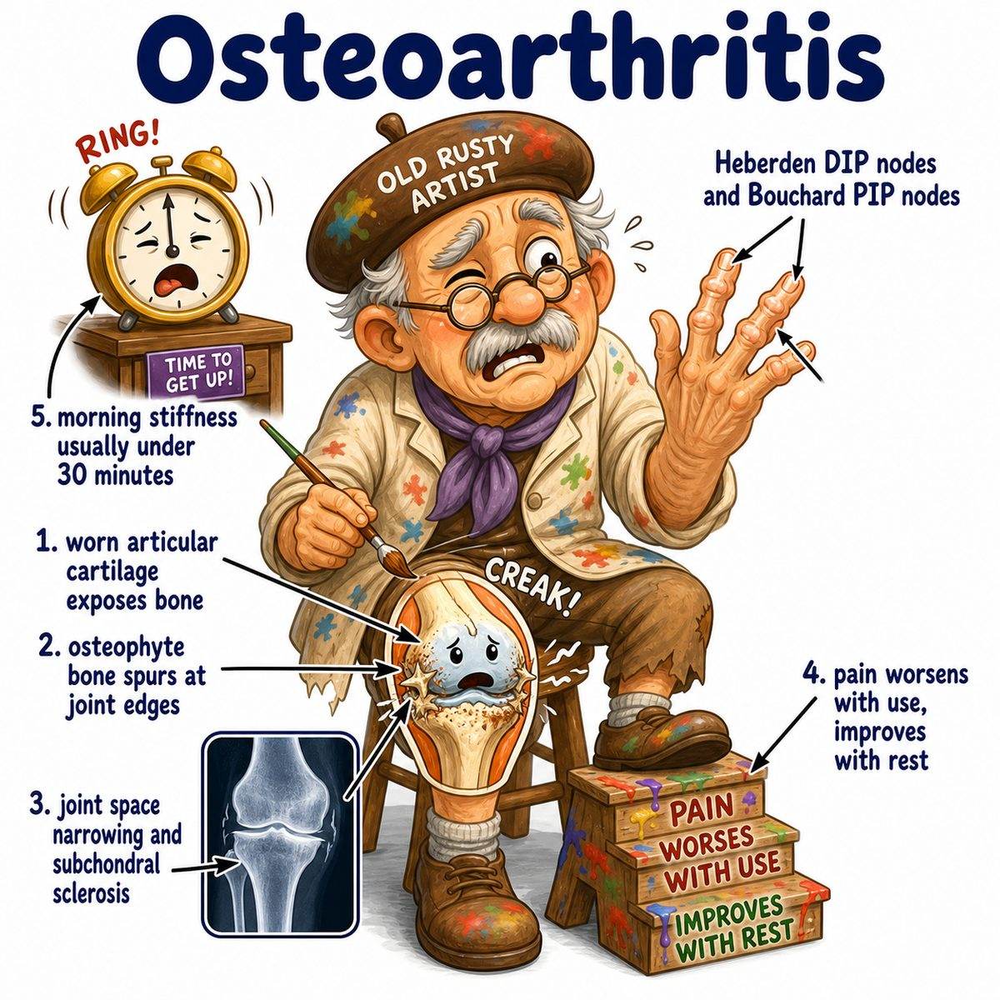
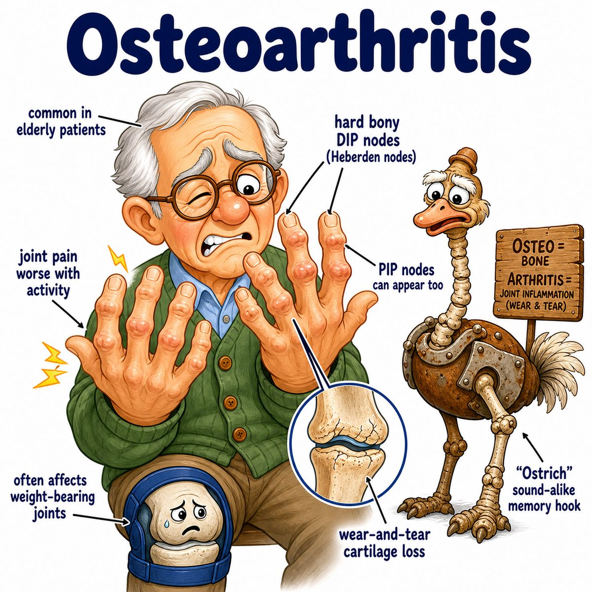

# Osteoarthritis

Osteoarthritis is “wear-and-tear” arthritis from degeneration of articular cartilage (smooth cartilage covering the ends of bones in a joint).

It commonly affects:

* knees
* hips
* spine
* DIP joints (distal interphalangeal joints, joints closest to the fingertips)
* PIP joints (proximal interphalangeal joints, middle finger joints)
* first CMC joint (carpometacarpal joint, base of the thumb)

---

### Core idea

The cartilage cushion breaks down, so the joint becomes less smooth and more bone-on-bone.

Then the bone reacts by forming:

* osteophytes (bone spurs)
* subchondral sclerosis (hardening/thickening of bone under cartilage)
* subchondral cysts (fluid-filled spaces in bone under cartilage)

---

### Why the symptoms happen

* **Pain worse with use:** movement loads the damaged joint surface
* **Pain better with rest:** less mechanical stress on the joint
* **Brief morning stiffness:** usually less than 30 minutes because this is not mainly inflammatory
* **Crepitus:** crackling/grinding from rough joint surfaces
* **Decreased range of motion:** osteophytes + cartilage loss mechanically limit movement

---

### X-ray findings

Think:

* joint space narrowing
* osteophytes
* subchondral sclerosis
* subchondral cysts

Why joint space narrows:

cartilage does not show well on X-ray, so the “space” between bones indirectly represents cartilage thickness. Less cartilage = less visible joint space.

---

### OA vs RA

OA (osteoarthritis):

* mechanical pain
* worse with activity
* DIP involvement common
* osteophytes
* noninflammatory joint fluid

RA (rheumatoid arthritis, autoimmune inflammatory arthritis):

* inflammatory pain
* prolonged morning stiffness
* MCP joints (metacarpophalangeal joints, knuckles) and PIP joints
* usually spares DIP joints
* pannus (inflammatory synovial tissue) causes erosions

---

## One-line intuition

Osteoarthritis is cartilage wearing down, then bone trying to “patch and stabilize” the joint by making extra bone.

---

## Pearl 🔥

Heberden nodes = DIP joint bony enlargement; Bouchard nodes = PIP joint bony enlargement.