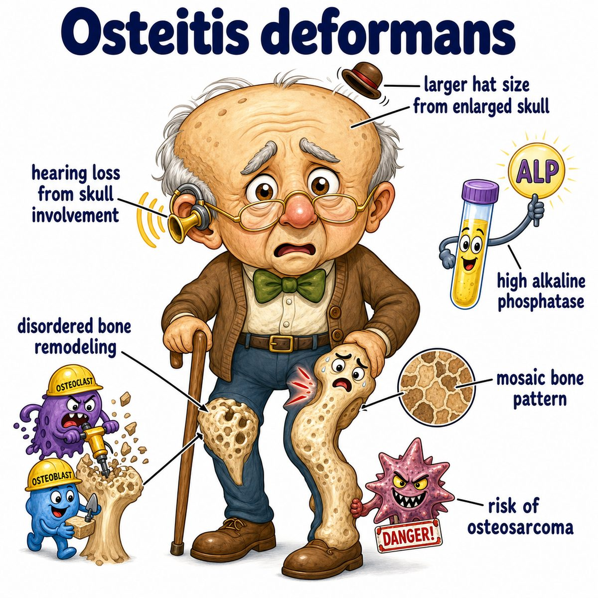
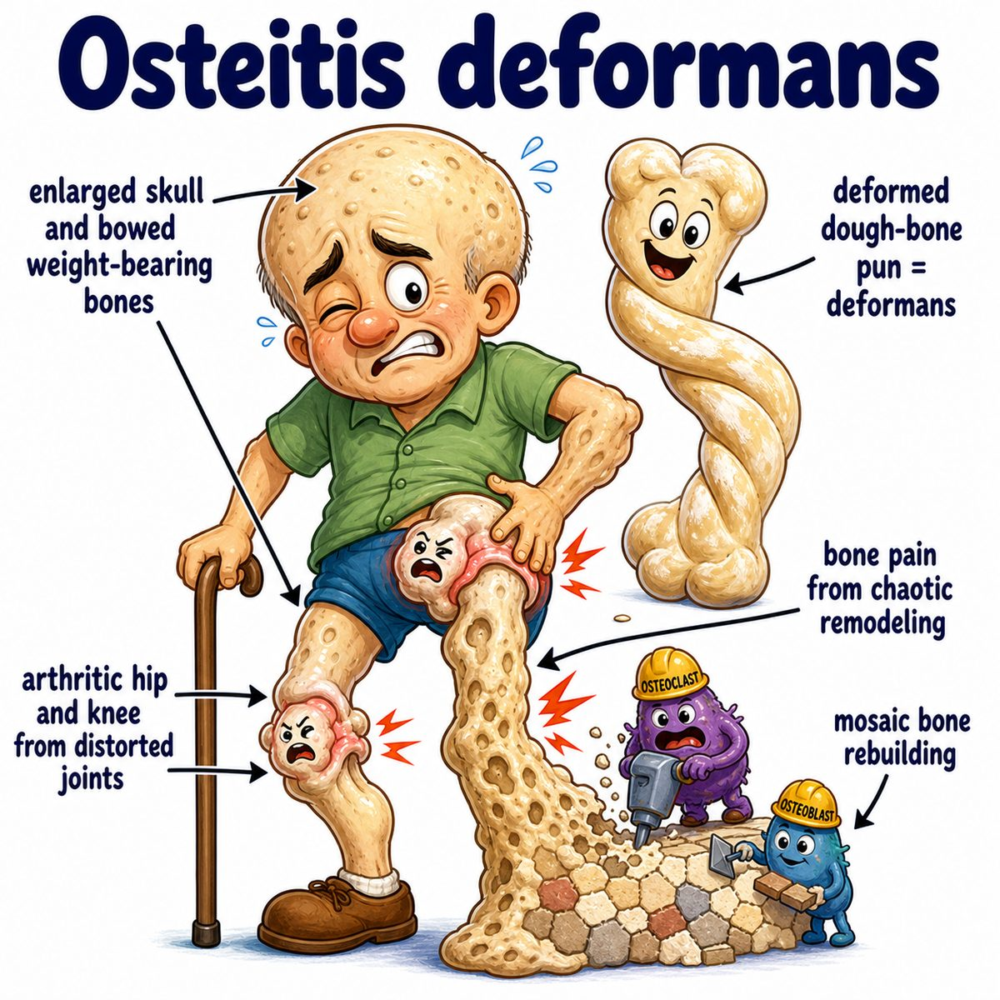

# Paget disease of bone

Paget disease of bone is a disorder where bone remodeling becomes too fast and disorganized.

Normal bone is constantly being:

* broken down by osteoclasts (bone-resorbing cells)
* rebuilt by osteoblasts (bone-forming cells)

In Paget disease:

* osteoclast activity goes up first
* osteoblasts try to repair the damage
* but the new bone is laid down in a messy, weak pattern

So the bone becomes:

* enlarged
* thickened
* deformed
* mechanically weak

---

### Why the findings happen

* **Bone pain:** rapid, abnormal remodeling irritates bone
* **Bowing deformities:** weak enlarged bone bends under body weight
* **Hearing loss:** skull involvement can compress cranial nerves (nerves coming from the brain)
* **High-output heart failure rarely:** pagetic bone is very vascular, so blood flow demand increases
* **Increased ALP (alkaline phosphatase):** osteoblasts are very active, and osteoblasts release ALP

Calcium and phosphate are usually normal because this is mainly a local bone remodeling problem, not a systemic calcium regulation problem.

---

### Classic pathology

Histology shows a **mosaic pattern**.

That means the bone looks like irregular puzzle pieces because old bone is being destroyed and rebuilt in a chaotic way.

---

## One-line intuition

Paget disease is bone remodeling on fast-forward: lots of breakdown, lots of repair, but the final bone is big, disorganized, and weak.

---

## Pearl

Paget disease of bone classically has **isolated increased ALP (alkaline phosphatase)** with normal calcium and phosphate.