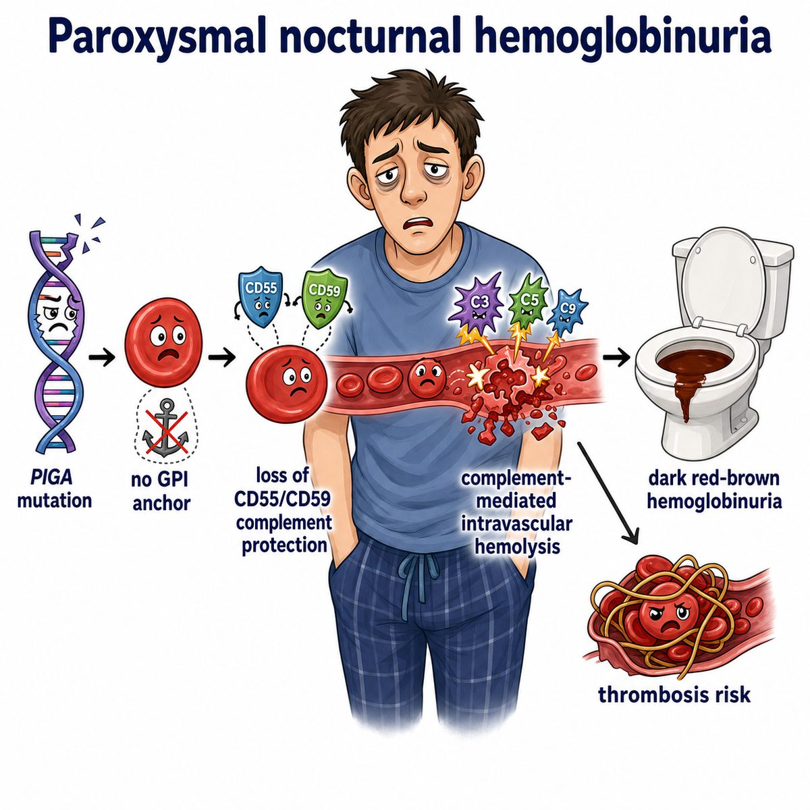
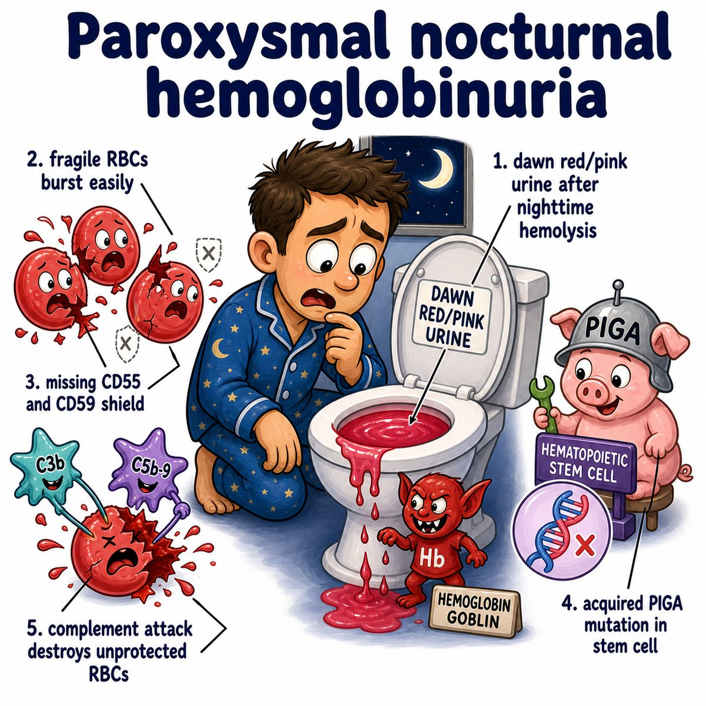

# Paroxysmal nocturnal hemoglobinuria

Paroxysmal nocturnal hemoglobinuria, or PNH (paroxysmal nocturnal hemoglobinuria), is an acquired stem cell disorder where blood cells are missing protective complement-blocking proteins.

Core mutation:

* somatic PIGA mutation
* PIGA helps make GPI anchors (glycosylphosphatidylinositol anchors)
* GPI anchors normally attach proteins to the cell surface

Important missing proteins:

* CD55 (cluster of differentiation 55)
* CD59 (cluster of differentiation 59)

These normally protect RBCs (red blood cells) from complement.

So the logic is:

> PIGA mutation -> no GPI anchors -> no CD55/CD59 -> complement attacks RBCs -> intravascular hemolysis

Break the name apart:

* paroxysmal = episodic
* nocturnal = at night
* hemoglobinuria = hemoglobin in urine

Why dark morning urine?

At night, mild respiratory acidosis can happen because breathing is slower. Lower pH can increase complement activity, so RBCs lyse more overnight. Free Hb (hemoglobin) gets filtered into urine, causing dark urine in the morning.

Key findings:

* Coombs-negative hemolytic anemia
* hemoglobinuria
* pancytopenia sometimes
* thrombosis
* abdominal pain or dysphagia from low nitric oxide

Why thrombosis?

Free Hb (hemoglobin) released from lysed RBCs binds nitric oxide. Nitric oxide normally relaxes smooth muscle and helps prevent platelet activation. So less nitric oxide means:

* vasoconstriction
* smooth muscle spasms
* increased thrombosis risk

Classic thrombosis site:

* hepatic vein thrombosis, also called Budd-Chiari syndrome

Diagnosis:

* flow cytometry (cell-sorting test using markers) showing loss of CD55/CD59 or loss of GPI-anchored proteins

Treatment idea:

* eculizumab blocks C5 (complement component 5)
* this prevents MAC (membrane attack complex) formation
* MAC is the complement pore that punches holes in cells

## One-line intuition

PNH is when RBCs lose their complement shield, so complement punches holes in them, especially overnight, causing hemolysis and dark urine.

## Pearl

PNH is Coombs-negative, meaning the direct antiglobulin test is negative, because RBC destruction is due to missing complement regulators, not antibodies stuck to the RBC surface.