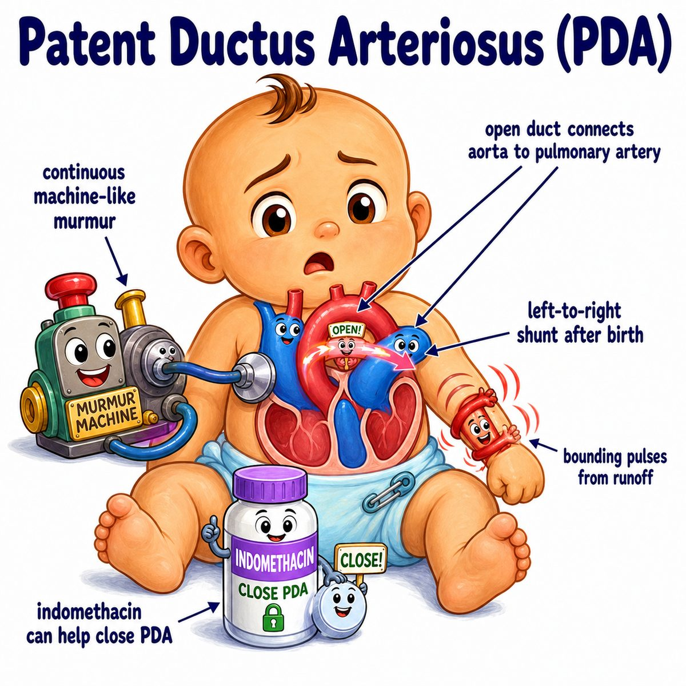

# Patent ductus arteriosus

Patent ductus arteriosus (PDA) means the ductus arteriosus stays open after birth.

Break it down:

* patent = open
* ductus arteriosus = fetal vessel connecting the pulmonary artery (vessel going to lungs) to the aorta (main artery leaving the heart)

Normally in the fetus, the lungs are not doing oxygen exchange yet, so blood bypasses the lungs through the ductus arteriosus.

After birth:

* lungs open
* oxygen rises
* prostaglandins (ductus-keeping-open signals) fall
* ductus arteriosus should close

In PDA, it does not close.

---

### Core idea

Blood flows from:

**aorta → pulmonary artery**

because aortic pressure is higher than pulmonary artery pressure.

So this is a **left-to-right shunt** (oxygenated left-sided blood goes back to the right-sided/pulmonary circulation).

---

### Why the findings happen

* **Continuous machine-like murmur:** blood keeps flowing through the PDA during systole and diastole because aortic pressure stays higher
* **Bounding pulses / widened pulse pressure:** blood runs off from the aorta into the pulmonary artery, dropping diastolic pressure
* **Pulmonary congestion:** extra blood gets dumped into the lungs
* **Left heart enlargement:** extra blood returns from lungs to left atrium (LA) and left ventricle (LV), so they volume overload

---

### Treatment logic

To close PDA:

* give indomethacin or ibuprofen
* these are NSAIDs (nonsteroidal anti-inflammatory drugs)
* they decrease prostaglandins

Less prostaglandin = ductus closes.

To keep the ductus open:

* give PGE1 (prostaglandin E1)

This is useful in ductal-dependent congenital heart disease, where the baby needs the ductus to survive until surgery.

---

## One-line intuition

PDA is a fetal lung-bypass vessel that forgot to close, so high-pressure aortic blood keeps leaking back into the lungs.

---

## Pearl 🔥

Congenital rubella classically causes PDA, plus cataracts and sensorineural deafness.