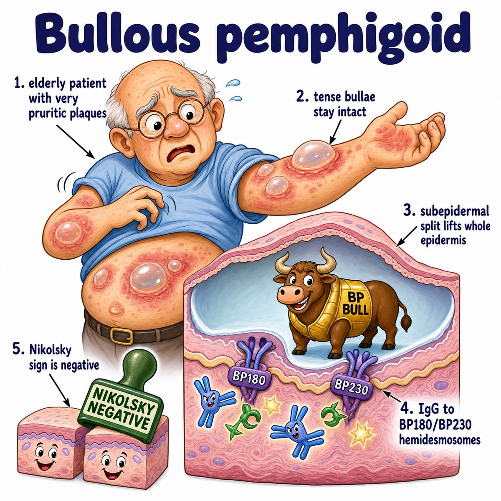
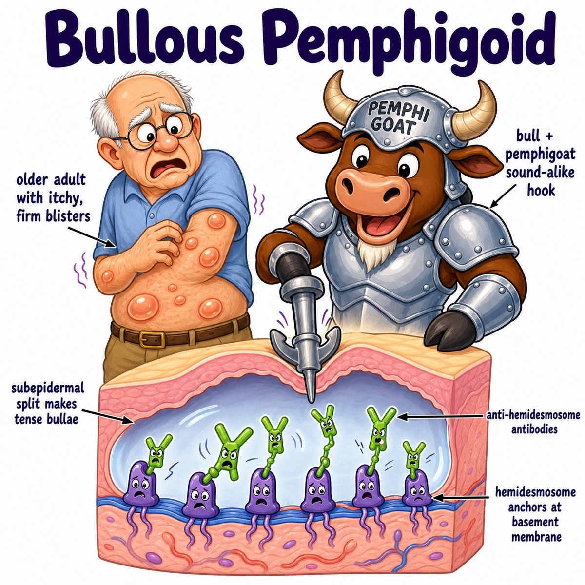

# Pemphigoid

Pemphigoid is an autoimmune blistering disease where antibodies attack the **basement membrane zone** (the attachment layer between epidermis and dermis).

The most Step 1-relevant type is **bullous pemphigoid**.

Classic idea:

* elderly patient
* very itchy skin
* large, tense bullae (fluid-filled blisters)
* usually little/no oral involvement

---

### What is being attacked?

Bullous pemphigoid has IgG (immunoglobulin G) antibodies against:

* BP180
* BP230

These are hemidesmosome proteins.

Hemidesmosomes are like “anchors” that hold the epidermis down to the basement membrane.

So if antibodies break those anchors:

* epidermis separates from dermis
* fluid collects under the epidermis
* you get a subepidermal blister

That is why the blisters are **tense**: the entire epidermis is still intact as the blister roof, so it is stronger.

---

### Immunofluorescence

Direct immunofluorescence (DIF; staining a skin biopsy to see where antibodies/complement are deposited) shows:

* linear IgG
* linear C3 (complement protein 3)
* along the basement membrane

Think:

> pemphigoid = straight line at the basement membrane

---

### Pemphigoid vs pemphigus vulgaris

Pemphigoid:

* anti-hemidesmosomes
* epidermis lifts off dermis
* subepidermal blister
* tense bullae
* oral lesions uncommon

Pemphigus vulgaris:

* anti-desmosomes
* skin cells detach from each other
* intraepidermal blister
* flaccid bullae
* oral lesions common

---

## One-line intuition

Pemphigoid is when antibodies attack the skin’s “floor anchors,” so the whole epidermis lifts up and forms tense blisters.

---

## Pearl 🔥

Bullous pemphigoid has a **negative Nikolsky sign** because the epidermis is not easily sheared off; pemphigus vulgaris has a positive Nikolsky sign because keratinocytes (epidermal skin cells) lose adhesion to each other.