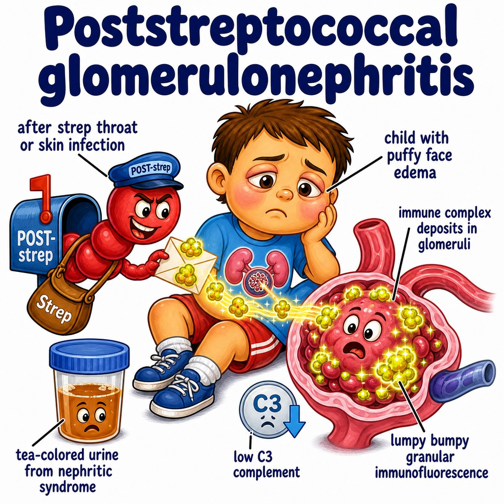

# Poststreptococcal glomerulonephritis

Poststreptococcal glomerulonephritis is kidney inflammation after a recent Streptococcus infection.

Break it down:

* post- = after
* streptococcal = caused by Streptococcus bacteria
* glomerulo- = glomerulus (kidney filtering ball)
* nephritis = kidney inflammation

So PSGN (poststreptococcal glomerulonephritis) means:

> the glomeruli get inflamed after a strep infection.

Usually this happens after:

* strep throat
* impetigo (superficial bacterial skin infection)

---

### Core idea

This is not because bacteria are directly attacking the kidney.

Instead:

* body fights the strep infection
* immune complexes form
* immune complexes get stuck in the glomerulus
* complement gets activated
* inflammation damages the filter

Immune complexes = antigen-antibody clumps.

Complement = blood proteins that help immune inflammation.

---

### Why the symptoms happen

The glomerulus is supposed to filter blood without letting RBCs (red blood cells) leak out.

But in PSGN, the inflamed filter gets damaged, so you get nephritic syndrome.

Nephritic syndrome = inflamed glomerulus causing blood in urine and reduced filtration.

Classic findings:

* hematuria (blood in urine), often cola-colored urine
* RBC casts (red blood cell casts in urine)
* oliguria (low urine output)
* hypertension (high blood pressure)
* periorbital edema (puffiness around the eyes)
* low C3 (low complement component 3)

Why edema and hypertension?

Inflamed glomeruli filter less, so the body retains salt and water.

More salt/water retention =

* swelling
* increased blood volume
* hypertension

---

### Pathology buzzwords

On immunofluorescence, PSGN has:

* granular IgG (immunoglobulin G) and C3 deposits
* "lumpy-bumpy" appearance

On electron microscopy, PSGN has:

* subepithelial humps

Subepithelial = under the podocyte epithelial side of the glomerular basement membrane.

Humps = immune complex deposits sitting like little bumps on the filter.

---

### Timing clue

PSGN usually appears after the infection, not during it.

That delay is because it takes time to make antibodies and immune complexes.

This is why a question stem may say:

* child had sore throat or skin infection a few weeks ago
* now has dark urine, edema, and hypertension

---

## One-line intuition

Strep is gone or improving, but the immune cleanup leaves complexes stuck in the kidney filter, causing a nephritic picture.

---

## Pearl 🔥

PSGN has low C3 because complement is being consumed, and ASO (antistreptolysin O) titers can show recent strep throat infection.