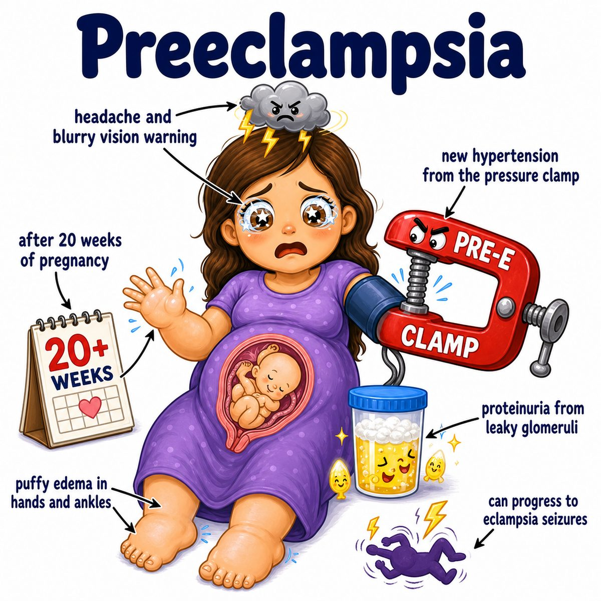

# Preeclampsia

### Core idea

Preeclampsia is new-onset hypertension after 20 weeks of pregnancy with either:

* proteinuria (protein in the urine)
* or signs of end-organ damage

Think:

> placenta problem causing mom-wide blood vessel dysfunction.

---

### Why it happens

The placenta normally invades and remodels the maternal spiral arteries.

Spiral arteries = maternal uterine arteries that bring blood to the placenta.

In preeclampsia:

* trophoblasts (placental cells that invade maternal tissue) do not remodel the spiral arteries well
* arteries stay narrow/high-resistance
* placenta gets relatively ischemic (low blood flow/oxygen)
* ischemic placenta releases factors that damage maternal endothelium

Endothelium = inner lining of blood vessels.

Damaged endothelium causes:

* vasoconstriction (blood vessels squeeze) -> hypertension
* leaky vessels -> edema (swelling)
* kidney glomerular injury -> proteinuria
* platelet activation -> thrombocytopenia (low platelets)
* liver irritation -> RUQ (right upper quadrant) pain and elevated liver enzymes
* brain irritation -> headache, vision changes, seizures if it becomes eclampsia

---

### Classic findings

After 20 weeks pregnant:

* hypertension
* proteinuria
* edema can happen, but is not required
* headache/visual symptoms are concerning
* RUQ pain suggests liver involvement

Eclampsia = preeclampsia + seizures.

HELLP syndrome = Hemolysis, Elevated Liver enzymes, Low Platelets.

---

## One-line intuition

Bad placental blood flow makes the placenta release toxic vascular signals, so mom gets systemic endothelial dysfunction: high BP, proteinuria, and organ injury.

---

## Pearl 🔥

Definitive treatment for preeclampsia is delivery of the placenta, because the placenta is the source of the disease-driving factors.