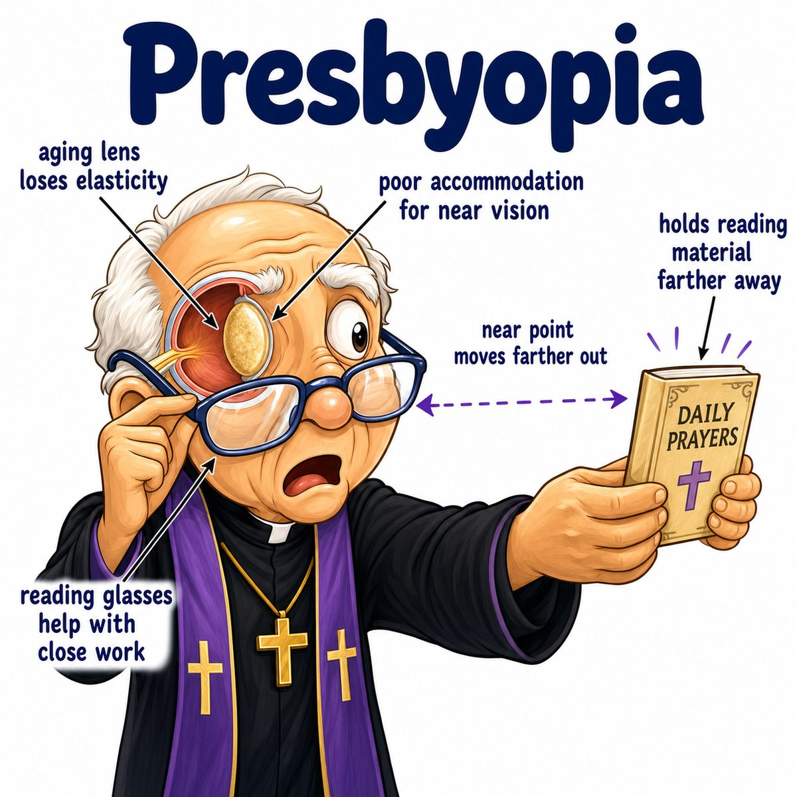

# Presbyopia

Presbyopia = age-related loss of near vision.

It happens because the lens becomes:

* stiffer
* less elastic
* less able to round up for near focus

Accommodation (changing lens shape to focus) normally works like this:

* near object = ciliary muscle contracts
* zonular fibers relax
* lens becomes rounder/thicker
* stronger refraction lets close objects focus on the retina

In presbyopia, the ciliary muscle may still try to contract, but the old stiff lens cannot round up enough.

So light from a close object focuses behind the retina instead of on the retina.

That causes:

* blurry near vision
* needing to hold books/phones farther away
* need for reading glasses

---

### One-line intuition

Presbyopia is when the lens gets too stiff with age to “squish into a round near-vision shape.”

---

### Why reading glasses help

Reading glasses are convex lenses (plus lenses) that add focusing power.

They do the extra bending that the aging lens can no longer do.

---

## Pearl 🔥

Presbyopia is not the same as hyperopia (farsightedness).

* Hyperopia = eye is too short or has too little refractive power
* Presbyopia = lens loses accommodation (ability to change shape for near vision) with age

Both can cause trouble seeing up close, but the mechanism is different.