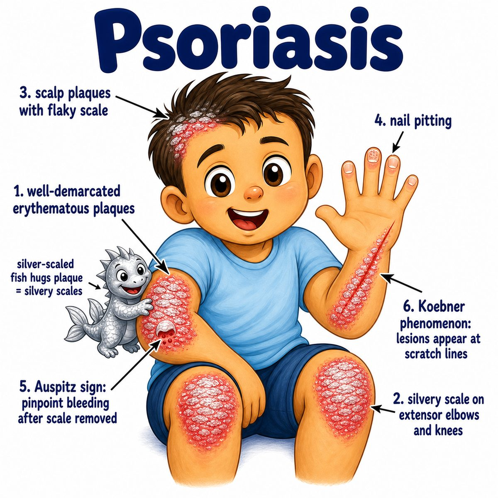

# Psoriasis

Psoriasis is a chronic inflammatory skin disease where the immune system makes skin cells grow way too fast.

Classic look:

* well-demarcated plaques
* erythematous base (red/inflamed skin)
* silvery scale
* often on elbows, knees, scalp, and extensor surfaces

Core idea:

> T cells overactivate keratinocytes (main epidermal skin cells), so the epidermis thickens and sheds as plaques.

Why the plaques happen:

* immune cells release cytokines (immune signaling proteins), especially IL-17 and IL-23 (interleukins 17 and 23)
* these signals make keratinocytes proliferate too quickly
* cells pile up before they mature properly
* that buildup becomes thick, flaky, silvery scale

So psoriasis is not just "dry skin."

It is:

* immune-driven
* hyperproliferative
* chronic/relapsing
* not contagious

Important associated findings:

* nail pitting
* onycholysis (nail separating from nail bed)
* psoriatic arthritis (joint inflammation associated with psoriasis)
* Auspitz sign (pinpoint bleeding after removing scale)
* Koebner phenomenon (new lesions appear at sites of skin trauma)

Guttate psoriasis:

* small "drop-like" lesions
* classically after strep throat
* strep = Streptococcus pyogenes infection

One-line intuition:

Psoriasis is T-cell-driven skin overgrowth: immune inflammation tells the epidermis to grow fast, so thick scaly plaques form.

HY pearl:

Psoriasis is strongly linked to Th17 cells (T helper 17 cells), IL-17, and IL-23, which is why biologics targeting IL-17 or IL-23 can treat it.