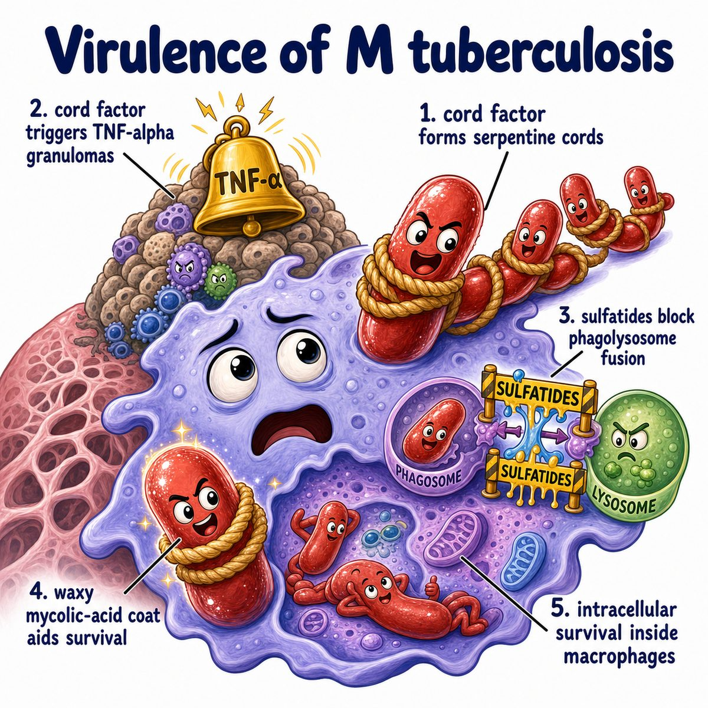
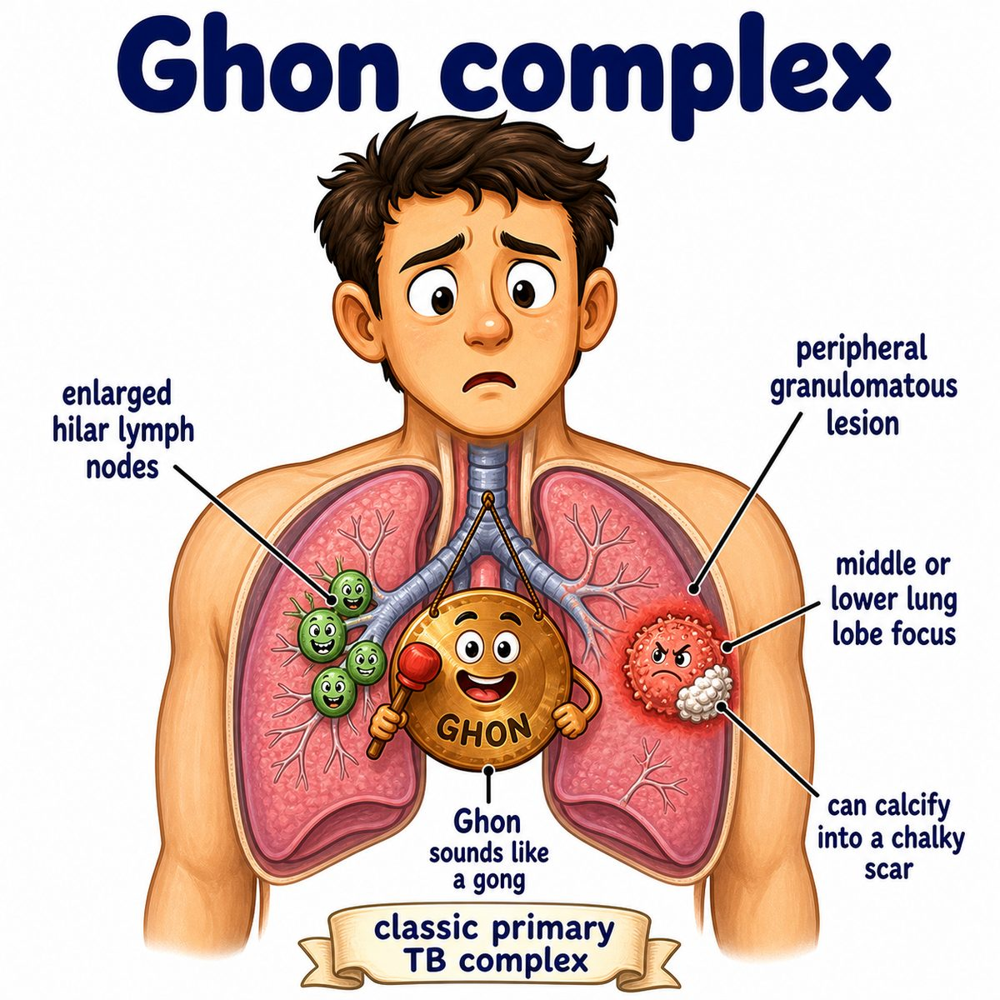

# Pulmonary tuberculosis

Pulmonary tuberculosis is tuberculosis in the lungs.

It is caused by **Mycobacterium tuberculosis (M. tuberculosis)**, an **acid-fast bacillus (AFB; rod-shaped bacterium that resists normal stains because of a waxy cell wall)**.

---

### Core idea

TB is an inhaled infection where bacteria enter the alveoli (tiny lung air sacs) and survive inside macrophages (immune cells that normally eat microbes).

Why it survives:

* M. tuberculosis has mycolic acids (waxy cell wall lipids)
* this helps it resist killing inside macrophages
* the immune system then tries to wall it off

That walling-off structure is a **granuloma (organized collection of immune cells around something hard to eliminate)**.

---

### What the granuloma looks like

Classic TB granuloma:

* caseating necrosis (cheese-like dead tissue)
* epithelioid macrophages (activated macrophages that look epithelial)
* Langhans giant cells (fused macrophages with nuclei around the edge)

Intuition:

The body cannot easily kill TB, so it quarantines it.

---

### Primary vs reactivation TB

Primary TB usually forms a **Ghon focus (primary lung granuloma)**, often in the lower/middle lung zones.

If the Ghon focus plus hilar lymph nodes (lymph nodes near the lung root) calcify, that is a **Ghon complex**.

Reactivation TB usually hits the lung apices (tops of the lungs).

Why apices?

* M. tuberculosis is an obligate aerobe (needs oxygen)
* the apices have higher oxygen tension
* so reactivation likes the upper lobes

---

### Symptoms

Active pulmonary TB can cause:

* chronic cough
* fever
* night sweats
* weight loss
* hemoptysis (coughing blood)

The cavitary lesions (holes in lung tissue) happen because chronic inflammation and caseous necrosis destroy lung tissue.

---

## One-line intuition

Pulmonary TB is a slow, waxy, intracellular lung infection that the immune system walls off into granulomas, but it can reactivate later in oxygen-rich upper lungs.

---

## Pearl 🔥

TB immunity is mainly **Th1 cell-mediated immunity (T helper 1 immune response)**:

* interleukin-12 (IL-12) activates Th1 cells
* Th1 cells release interferon-gamma (IFN-gamma)
* IFN-gamma activates macrophages

So defects in IL-12, IFN-gamma, or tumor necrosis factor-alpha (TNF-alpha) increase risk of severe/reactivated TB.