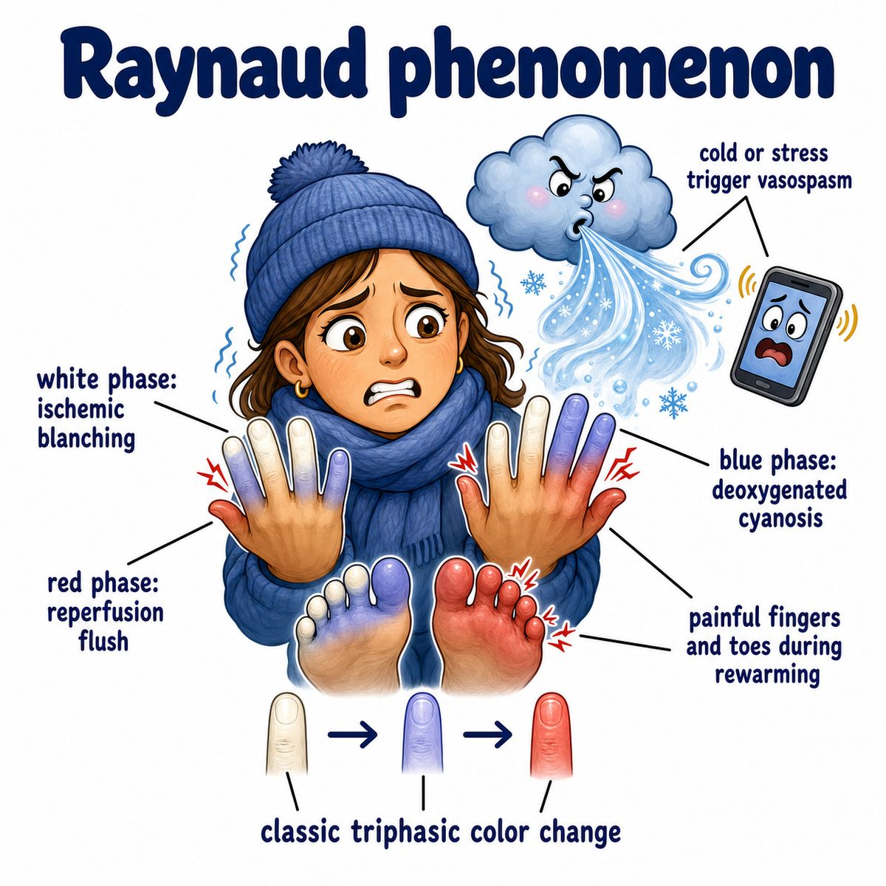

# Raynaud disease

### Core idea

Raynaud disease is episodic vasospasm (sudden narrowing of blood vessels) of small arteries/arterioles (small arteries) in the fingers or toes.

Usually triggered by:

* cold
* emotional stress

The classic color change is:

* white = ischemia (low blood flow)
* blue = cyanosis (low oxygen in stagnant blood)
* red = reperfusion (blood flow returning)

---

### Why the fingers change color

Cold or stress activates sympathetic nerves (fight-or-flight nerves).

That causes digital arteries (arteries of the fingers/toes) to clamp down too much.

So:

* less blood gets in → fingers turn white
* blood sitting there loses oxygen → fingers turn blue
* vessels relax and blood rushes back → fingers turn red, painful, or tingly

---

### Primary vs secondary

**Primary Raynaud disease** = Raynaud by itself, no underlying disease.

Usually:

* young woman
* symmetric
* mild
* no ulcers or tissue damage

**Secondary Raynaud phenomenon** = Raynaud due to another condition.

Think:

* systemic sclerosis/scleroderma (autoimmune disease causing skin and organ fibrosis)
* SLE (systemic lupus erythematosus, autoimmune disease with immune complex damage)
* mixed connective tissue disease

Secondary is more concerning because damaged vessels can cause:

* ulcers
* ischemia
* tissue necrosis (tissue death)

---

### One-line intuition

Raynaud is when finger blood vessels overreact to cold/stress and temporarily shut off blood flow.

---

## Pearl 🔥

Raynaud is a classic feature of CREST syndrome:

* Calcinosis
* Raynaud phenomenon
* Esophageal dysmotility
* Sclerodactyly
* Telangiectasias

CREST is a limited form of systemic sclerosis (autoimmune fibrosis disease).