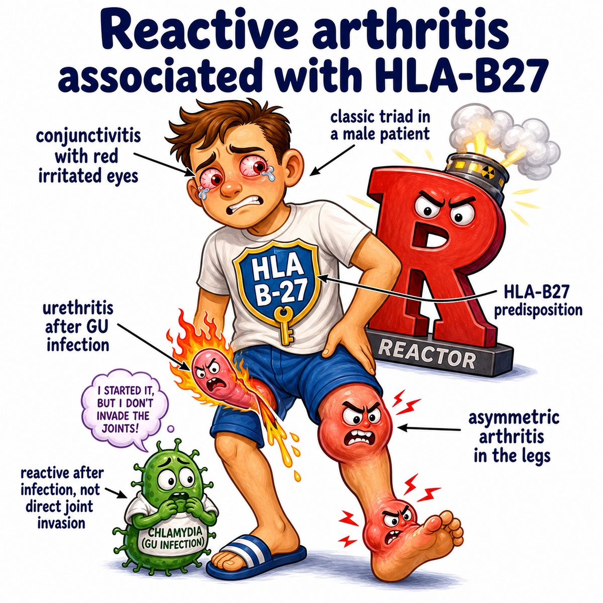

# Reactive arthritis

### Core idea

Reactive arthritis is joint inflammation that happens **after an infection somewhere else** in the body.

Usually after:

* GI (gastrointestinal) infection: Salmonella, Shigella, Campylobacter, Yersinia
* GU (genitourinary) infection: Chlamydia trachomatis

Key idea:

> the joint is inflamed, but the bacteria are usually not inside the joint.

So it is “reactive” because the immune system reacts to a prior infection.

---

### Classic triad

Think:

> can’t see, can’t pee, can’t climb a tree

Meaning:

* conjunctivitis (eye inflammation)
* urethritis (inflammation of the urethra, the tube urine exits through)
* arthritis (joint inflammation)

The arthritis is usually:

* asymmetric
* lower extremity
* knees, ankles, feet
* sometimes sacroiliac joints (joints between sacrum and pelvis)

---

### Why it happens

After an infection, the immune system gets activated.

In genetically susceptible people, especially HLA-B27 (human leukocyte antigen B27), the immune response can cross-react with the body’s own tissues.

That causes inflammation in:

* joints
* eyes
* urethra
* skin
* tendon insertion sites

Tendon insertion inflammation is called enthesitis (inflammation where tendon/ligament attaches to bone), which is why heel pain and Achilles pain can happen.

---

### Skin findings

Reactive arthritis can cause:

* keratoderma blennorrhagicum (thick, scaly rash on palms/soles)
* circinate balanitis (painless shallow lesions on glans penis)
* oral ulcers

Keratoderma blennorrhagicum can look psoriasis-like.

---

## One-line intuition

A GI (gastrointestinal) or GU (genitourinary) infection flips on the immune system, and the immune system keeps firing at joints, eyes, urethra, skin, and tendon insertions even after the infection is gone.

---

## Pearl 🔥

Reactive arthritis is a **seronegative spondyloarthropathy**: seronegative means rheumatoid factor is usually negative, and spondyloarthropathy means inflammatory arthritis that can involve the spine/sacroiliac joints and entheses (tendon/ligament attachment sites).