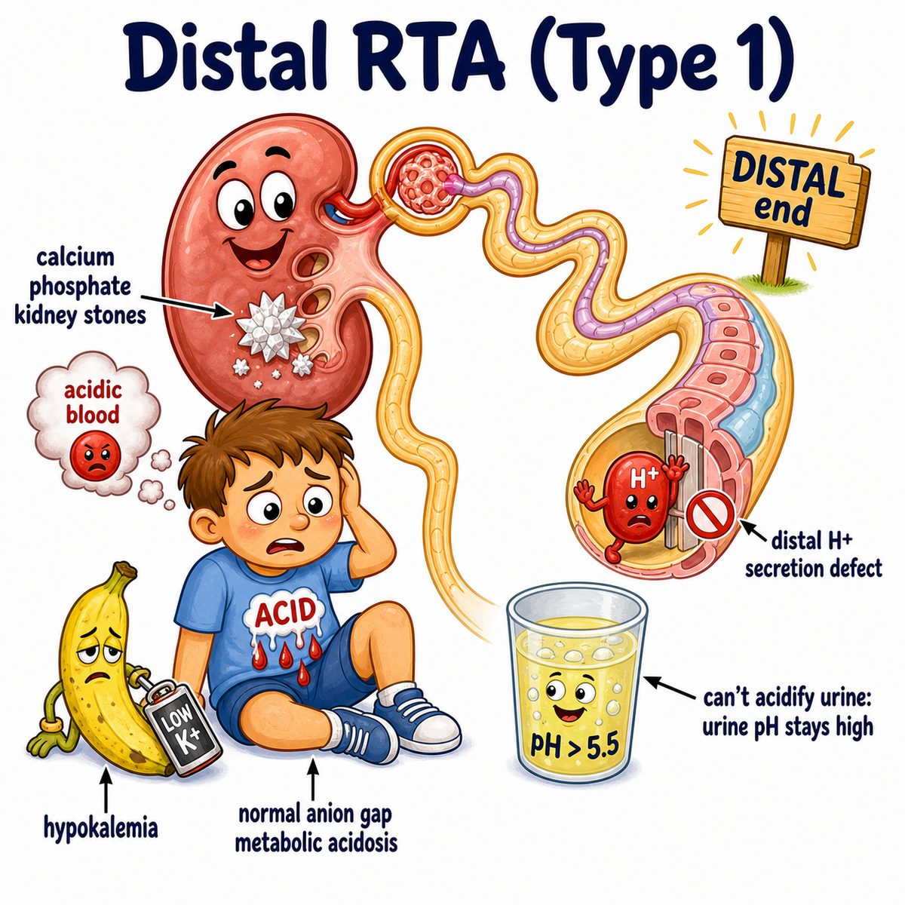
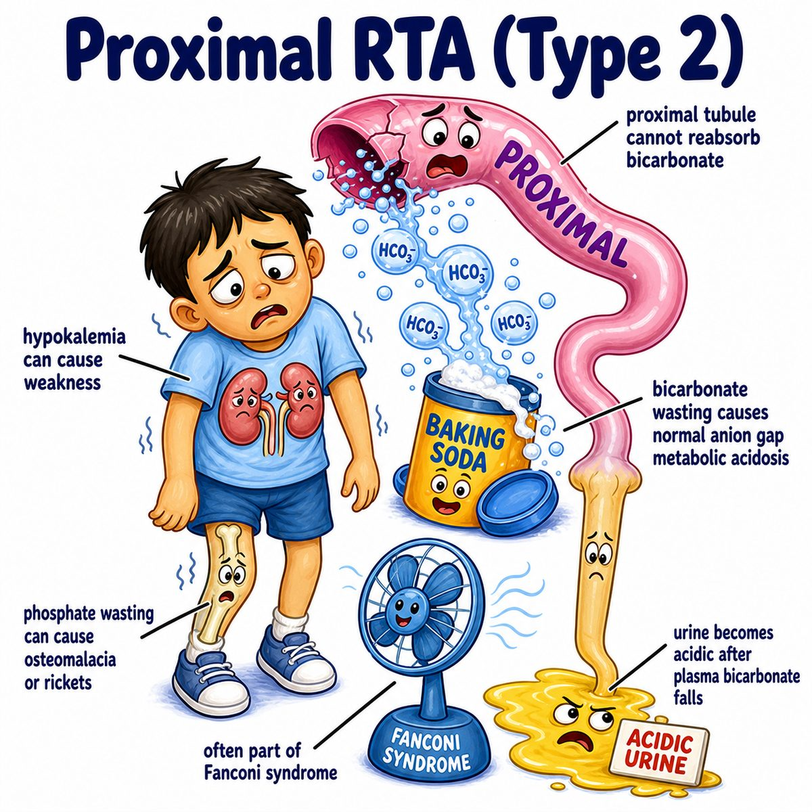
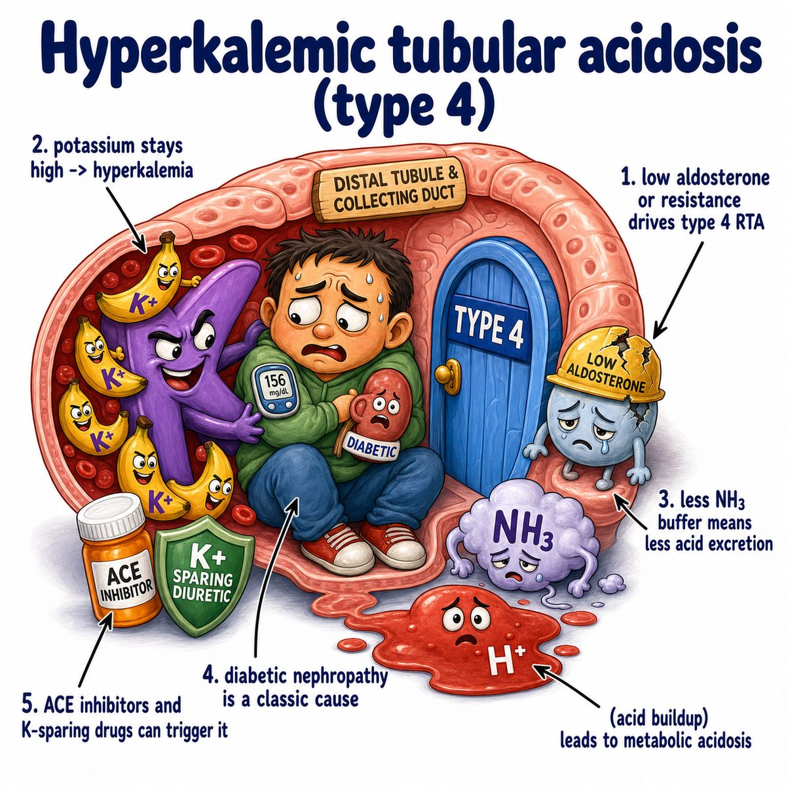

# Renal tubular acidosis

Renal tubular acidosis (RTA) = metabolic acidosis (too much acid in blood) because the renal tubules (kidney tubes that modify urine) cannot handle acid/base correctly.

Key idea:

* GFR (glomerular filtration rate = kidney filtering ability) is often relatively preserved
* problem is the tubules
* classically causes normal anion gap metabolic acidosis

Anion gap = unmeasured acids in blood.

So RTA is:

> kidney tubule acid/base handling problem causing normal anion gap acidosis.

---

### The 3 main types

## Type 1 RTA = distal RTA

Problem:

* distal tubule/collecting duct cannot secrete H+ (hydrogen ion, acid) into urine

So:

* H+ stays in blood → metabolic acidosis
* urine stays too basic → urine pH > 5.5
* K+ (potassium) is usually low

Why stones happen:

* alkaline urine favors calcium phosphate stones
* chronic acidosis pulls buffer from bone → more calcium release

So type 1 is associated with:

* kidney stones
* nephrocalcinosis (calcium deposits in kidney)
* hypokalemia (low potassium)

Intuition:
The distal nephron is supposed to dump acid into urine, but it fails, so the blood stays acidic and the urine stays inappropriately basic.

---

## Type 2 RTA = proximal RTA

Problem:

* proximal tubule cannot reabsorb HCO3- (bicarbonate, the main blood base/buffer)

So:

* bicarbonate is wasted in urine
* blood loses buffer → metabolic acidosis
* K+ (potassium) is usually low

Urine pH can be tricky:

* early: urine can be basic because bicarbonate is spilling out
* later: urine can become acidic once blood bicarbonate is already low

Important association:

* Fanconi syndrome (general proximal tubule dysfunction)

Fanconi syndrome can cause wasting of:

* glucose
* amino acids
* phosphate
* bicarbonate

Intuition:
The proximal tubule normally reclaims bicarbonate. If it cannot, the body loses its base, so acid wins.

---

## Type 4 RTA = hyperkalemic RTA

Problem:

* low aldosterone or aldosterone resistance

Aldosterone = hormone that helps the collecting duct excrete K+ (potassium) and H+ (acid).

So:

* less H+ secretion → metabolic acidosis
* less K+ secretion → hyperkalemia (high potassium)

Classic causes:

* diabetic nephropathy
* ACE inhibitors (angiotensin-converting enzyme inhibitors)
* ARBs (angiotensin receptor blockers)
* spironolactone
* NSAIDs (nonsteroidal anti-inflammatory drugs)
* adrenal insufficiency

Intuition:
No aldosterone effect means the kidney holds onto potassium and acid.

---

### Quick memory table

* Type 1 = distal problem = cannot secrete H+ → high urine pH, low K+, stones
* Type 2 = proximal problem = cannot reabsorb HCO3- → low K+, Fanconi association
* Type 4 = aldosterone problem = cannot excrete K+ or H+ → high K+

---

## One-line intuition

RTA means the kidney filters okay, but the tubules fail acid/base cleanup, so acid builds up in blood.

---

## HY pearl 🔥

RTA causes normal anion gap metabolic acidosis because lost bicarbonate is replaced by chloride, so it is also called hyperchloremic metabolic acidosis.