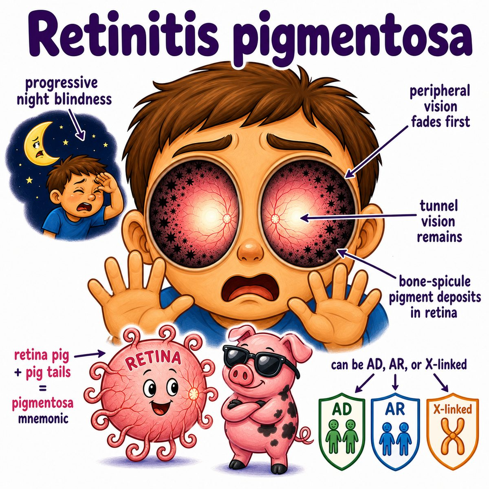

# Retinitis pigmentosa

Retinitis pigmentosa is an inherited retinal degeneration where photoreceptors slowly die.

Photoreceptors = the light-sensing cells in the retina:

* rods = night vision + peripheral vision
* cones = color vision + central sharp vision

In retinitis pigmentosa, rods usually die first.

So the classic symptoms are:

* night blindness first
* peripheral vision loss
* tunnel vision later

---

### Why those symptoms happen

Rods are concentrated more in the peripheral retina and are used for dim-light vision.

So if rods degenerate first:

* dim light becomes hard to see in
* peripheral vision disappears
* central vision can be preserved until later because cones are concentrated in the macula/fovea

Macula = central retina for sharp vision.

Fovea = very center of the macula with the highest visual acuity.

---

### Classic eye exam findings

On fundus exam, you can see:

* bone-spicule pigmentation
* narrowed retinal vessels
* pale optic disc

Bone-spicule pigmentation = dark, branching pigment clumps in the retina.

The pigment comes from damaged RPE (retinal pigment epithelium), which is the support layer under the photoreceptors.

---

### Genetics

Retinitis pigmentosa can be:

* autosomal dominant
* autosomal recessive
* X-linked

Autosomal = gene is on a non-sex chromosome.

X-linked = gene is on the X chromosome.

Many cases involve mutations affecting phototransduction, which is how photoreceptors turn light into electrical signals.

---

## One-line intuition

Retinitis pigmentosa is rods dying before cones, so the patient loses night/peripheral vision before central vision.

---

## Pearl 🔥

HY association: retinitis pigmentosa + sensorineural hearing loss = Usher syndrome.

Sensorineural hearing loss = hearing loss from the inner ear or auditory nerve, not from earwax/middle ear blockage.