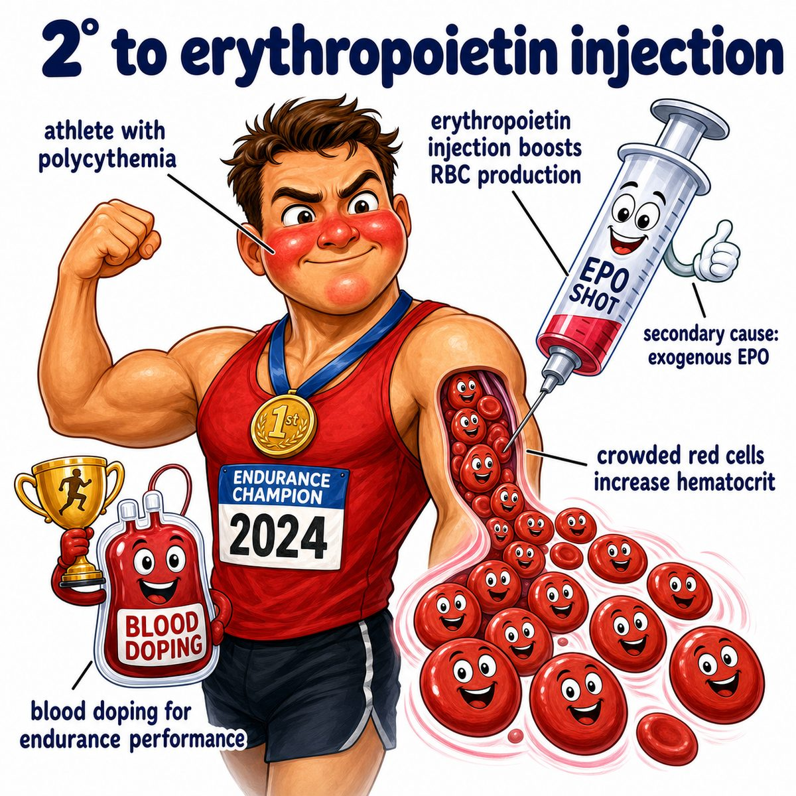

# Secondary polycythemia

### Core idea

Secondary polycythemia = increased red blood cells because something outside the bone marrow is stimulating red blood cell production.

Usually that stimulus is increased EPO (erythropoietin), a kidney hormone that tells bone marrow to make more RBCs (red blood cells).

---

### Why it happens

The body thinks oxygen delivery is too low:

* low oxygen sensed by kidney
* kidney releases more EPO (erythropoietin)
* EPO stimulates bone marrow
* bone marrow makes more RBCs (red blood cells)
* hematocrit rises

Hematocrit = percent of blood volume made of RBCs (red blood cells).

So this is basically:

> low oxygen signal -> high EPO -> high RBCs

---

### Common causes

Think chronic hypoxia (low tissue oxygen):

* COPD (chronic obstructive pulmonary disease)
* obstructive sleep apnea
* high altitude
* cyanotic congenital heart disease
* smoking/carbon monoxide exposure

Also can happen from inappropriate EPO (erythropoietin) production:

* renal cell carcinoma
* hepatocellular carcinoma
* EPO doping
* testosterone use

---

### Why symptoms happen

Too many RBCs (red blood cells) make blood more viscous/thick.

That can cause:

* headache
* dizziness
* blurry vision
* hypertension
* thrombosis risk

Thrombosis = clot formation inside blood vessels.

---

### How to distinguish from polycythemia vera

Secondary polycythemia:

* high EPO (erythropoietin)
* usually normal WBCs (white blood cells) and platelets
* driven by hypoxia or EPO-producing tumors/drugs

Polycythemia vera:

* low EPO (erythropoietin)
* JAK2 mutation
* increased RBCs (red blood cells), WBCs (white blood cells), and platelets
* primary bone marrow problem

---

## One-line intuition

Secondary polycythemia is the body trying to compensate for poor oxygen delivery by making extra RBC oxygen carriers.

---

## Pearl 🔥

High EPO (erythropoietin) points toward secondary polycythemia; low EPO points toward polycythemia vera because the bone marrow is making RBCs autonomously.