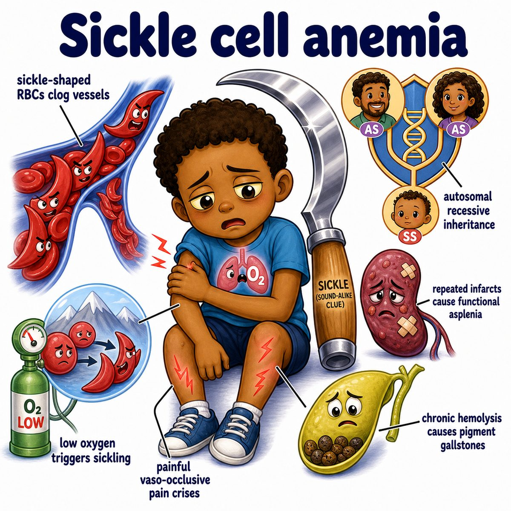
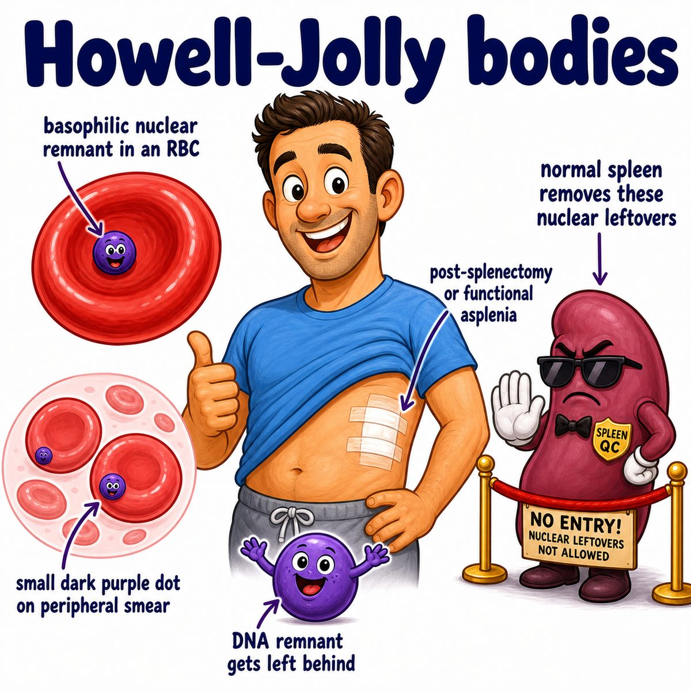
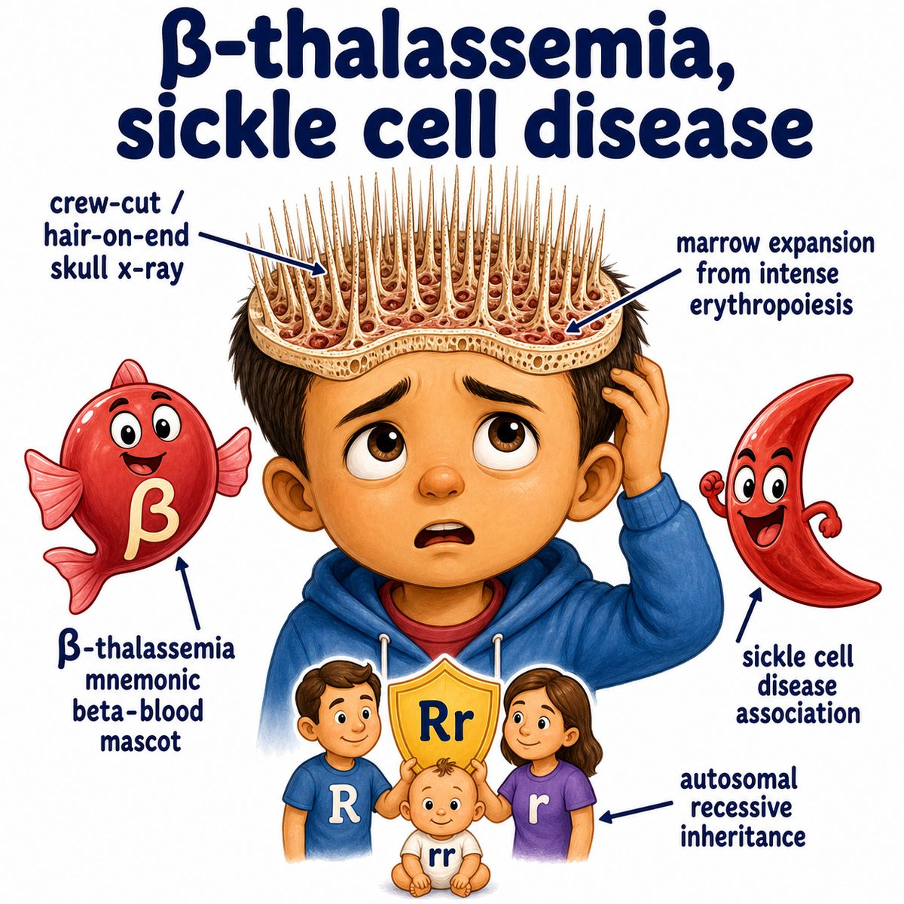

# Sickle cell disease

### Core idea

Sickle cell disease is an inherited hemoglobin disorder.

Hemoglobin is the oxygen-carrying protein inside RBCs (red blood cells).

In sickle cell disease, the patient makes HbS (sickle hemoglobin), which can make RBCs become:

* sickle-shaped
* rigid
* sticky
* fragile

So the main problems are:

* vaso-occlusion, meaning blocked blood vessels
* hemolytic anemia, meaning RBCs break apart too early

---

### Why the cells sickle

Classic mutation:

* beta-globin gene mutation
* glutamic acid is replaced by valine
* this makes HbS polymerize when deoxygenated

Polymerize means the hemoglobin molecules stick together in long chains.

So when oxygen is low:

* HbS clumps together
* the RBC gets distorted into a sickle shape
* the stiff sickled RBC cannot squeeze through small vessels well

---

### Why the symptoms happen

* **Pain crises:** sickled RBCs block small vessels, causing ischemia (low blood flow/oxygen)
* **Anemia:** sickled RBCs are fragile and get destroyed early
* **Jaundice:** hemolysis releases bilirubin, causing yellowing
* **Dactylitis:** painful swelling of hands/feet in kids from vaso-occlusion
* **Acute chest syndrome:** sickling in lung vessels causes chest pain, fever, hypoxia (low oxygen), and infiltrates on chest X-ray
* **Stroke:** sickled RBCs can block brain blood flow

---

### Spleen connection

The spleen filters abnormal RBCs.

In sickle cell disease, sickled cells repeatedly block splenic blood flow, causing repeated infarctions (tissue death from lack of blood).

Over time this causes autosplenectomy, meaning the spleen basically destroys itself and stops working.

That is why patients are at high risk for encapsulated bacteria, especially:

* Streptococcus pneumoniae
* Haemophilus influenzae
* Neisseria meningitidis

Encapsulated means the bacteria have a protective capsule, and the spleen is important for clearing them.

---

### Genetics

Sickle cell disease is autosomal recessive.

Autosomal recessive means you need 2 bad copies of the gene to have the disease.

* HbSS = sickle cell disease
* HbAS = sickle cell trait

Sickle cell trait usually has much milder symptoms because the person still makes a lot of normal HbA (adult hemoglobin).

---

## One-line intuition

Low oxygen makes HbS clump, which bends RBCs into rigid sickles that clog vessels and break apart early.

---

## Pearl 🔥

Sickle cell trait protects against malaria because RBCs infected by Plasmodium falciparum are more likely to sickle and get cleared by the spleen.