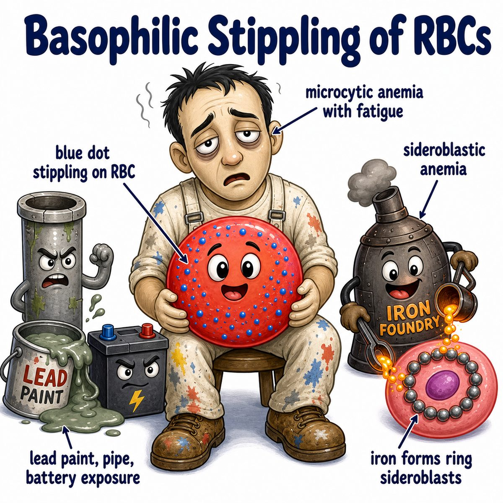

# Sideroblastic anemia

### Core idea

Sideroblastic anemia = anemia where the body has iron, but cannot properly put that iron into heme (the iron-containing part of hemoglobin).

So iron gets stuck in mitochondria (energy-producing organelles) around the nucleus of erythroblasts (immature red blood cell precursors).

That creates:

* ring sideroblasts in bone marrow
* poor hemoglobin production
* anemia

---

### Why the ring happens

Normally:

* iron + protoporphyrin = heme
* heme + globin = hemoglobin

In sideroblastic anemia:

* heme synthesis is blocked
* iron cannot be used correctly
* iron piles up around the nucleus inside mitochondria

That perinuclear iron ring is the classic **ring sideroblast**.

---

### Classic causes

Think: anything that blocks heme synthesis.

* ALAS2 mutation (aminolevulinic acid synthase 2 mutation) = congenital/X-linked cause
* vitamin B6 deficiency, because vitamin B6 is needed for ALA synthase (aminolevulinic acid synthase)
* isoniazid, because it can cause vitamin B6 deficiency
* lead poisoning
* alcohol
* MDS (myelodysplastic syndrome, a clonal bone marrow disorder)

---

### Labs intuition

Iron studies usually show too much unused iron:

* increased serum iron
* increased ferritin (iron storage protein)
* increased transferrin saturation
* decreased or normal TIBC (total iron-binding capacity)

MCV (mean corpuscular volume, red blood cell size) is often low because low heme means low hemoglobin, and low hemoglobin makes RBCs (red blood cells) smaller/paler.

---

## One-line intuition

Sideroblastic anemia is an iron-utilization problem: iron is present, but heme synthesis is broken, so iron gets trapped around the nucleus instead of becoming hemoglobin.

---

## Pearl 🔥

Lead poisoning causes sideroblastic anemia by inhibiting heme synthesis enzymes, especially ALA dehydratase (aminolevulinic acid dehydratase) and ferrochelatase.