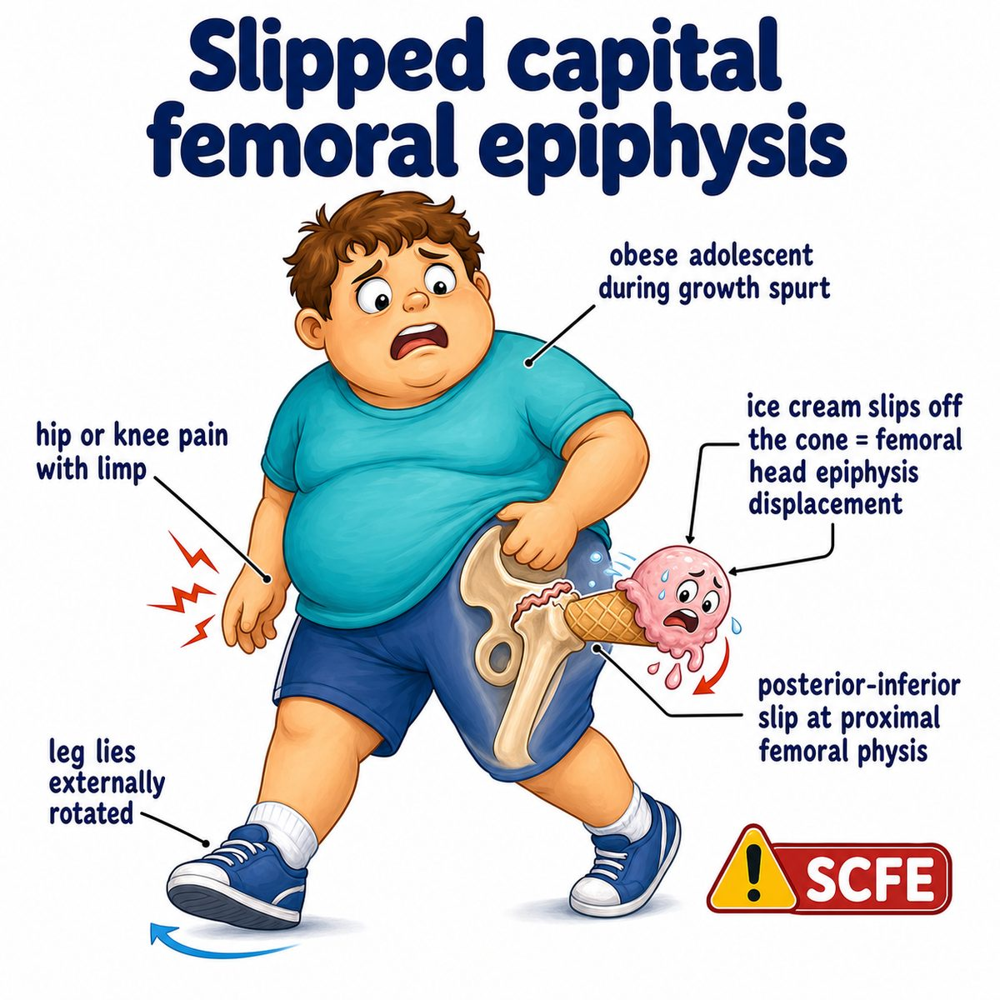

# Slipped capital femoral epiphysis

### Core idea

Slipped capital femoral epiphysis, or **SCFE** (**slipped capital femoral epiphysis**), is when the femoral head slips off the femoral neck through the growth plate.

More intuitive:

* the **epiphysis** = the end part of the bone
* the **capital femoral epiphysis** = the femoral head, or “ball” of the hip joint
* the **physis** = growth plate
* SCFE = the femoral head stays in the socket, but the femoral neck shifts forward/upward

Classic phrase:

> The ice cream stays in the cone, but the cone slips out from under it.

---

### Who gets it

Usually:

* adolescent
* overweight male
* hip, groin, thigh, or knee pain
* limp

Knee pain is important because hip pathology can refer pain to the knee through shared nerve pathways.

---

### Why it happens

During puberty, the growth plate is weaker.

If there is increased mechanical stress, especially from obesity, the femoral neck can shear across the growth plate.

So the problem is basically:

* weak growth plate
* heavy load
* shearing force across the hip

That causes the epiphysis to “slip” relative to the metaphysis (**metaphysis** = widened bone region next to the growth plate).

---

### Key exam finding

Limited internal rotation of the hip.

Often the leg rests in:

* external rotation
* abduction

When the hip is flexed, it may automatically externally rotate. This is called **Drehmann sign** (**obligatory external rotation during hip flexion**).

---

### X-ray idea

Look for loss of **Klein line** intersection.

**Klein line** = a line drawn along the superior femoral neck.

Normally, it should intersect part of the femoral head.

In SCFE:

* the femoral head sits below that line
* the line misses the epiphysis

---

### Treatment idea

Do not forcefully reduce it.

Treatment is usually urgent orthopedic fixation with a screw, meaning the goal is to pin it in place so the slip does not worsen.

---

## One-line intuition

SCFE is an adolescent hip growth plate injury where the femoral head stays in the socket while the femoral neck slips away underneath it.

---

## Pearl 🔥

SCFE can present as **knee pain**, so an overweight adolescent with knee pain + limp should still make you think of a hip problem.