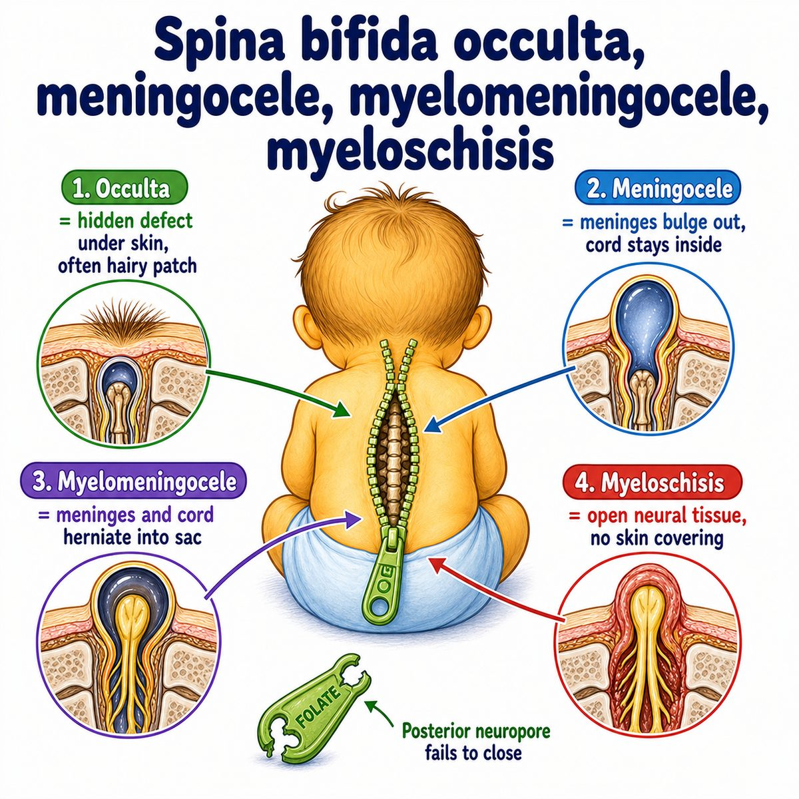
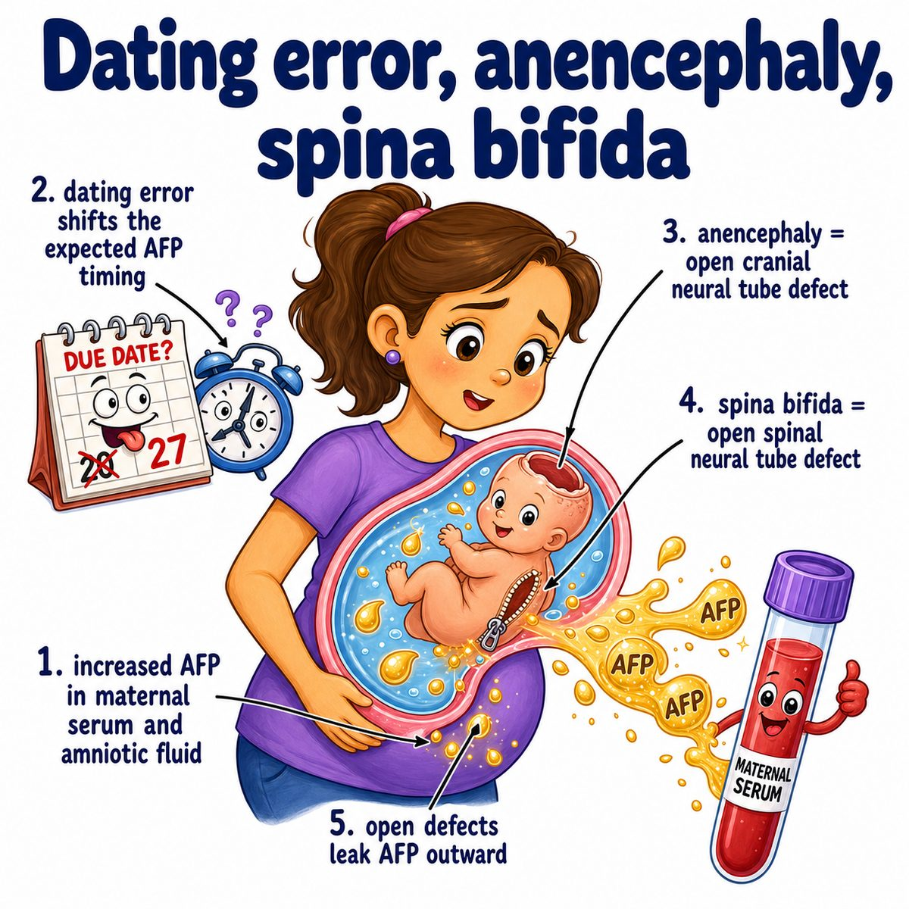

# Spina bifida

### Core idea

Spina bifida is a neural tube defect (NTD = failure of the embryonic brain/spinal cord tube to close properly).

Specifically:

* the posterior vertebral arches do not close
* the spinal canal stays open
* meninges (protective coverings of the brain/spinal cord) +/- spinal cord can protrude out

Break the word apart:

* spina = spine
* bifida = split

So:

> spina bifida = split/open spine.

---

### Why it happens

During early development, the neural tube should close.

If it does not close in the lower part:

* the spinal cord area is exposed or poorly protected
* nerves can be damaged
* motor/sensory function below the lesion can be impaired

That is why lower lesions can cause:

* leg weakness/paralysis
* sensory loss
* bladder and bowel dysfunction

---

### Main types

* **Spina bifida occulta:** mildest; vertebral defect only, usually no sac; may have hair tuft/dimple
* **Meningocele:** meninges herniate out, but spinal cord stays in place
* **Myelomeningocele:** meninges + spinal cord herniate out; most severe/common clinically tested type

Myelomeningocele is the big Step 1 one.

---

### Testing associations

Open spina bifida causes leakage of fetal proteins into amniotic fluid and maternal blood.

So you can see:

* increased maternal serum AFP (alpha-fetoprotein)
* increased amniotic fluid AFP (alpha-fetoprotein)
* increased amniotic acetylcholinesterase (enzyme marker of open neural tube defects)

Also associated with Chiari II malformation (downward displacement of hindbrain structures), which can cause hydrocephalus (too much cerebrospinal fluid in the brain ventricles).

---

## One-line intuition

The spine fails to close over the spinal cord, so the cord/meninges can bulge out and damage nerves.

---

## Pearl 🔥

Folate deficiency increases risk of neural tube defects (NTDs), so folic acid supplementation before pregnancy helps prevent spina bifida and anencephaly.