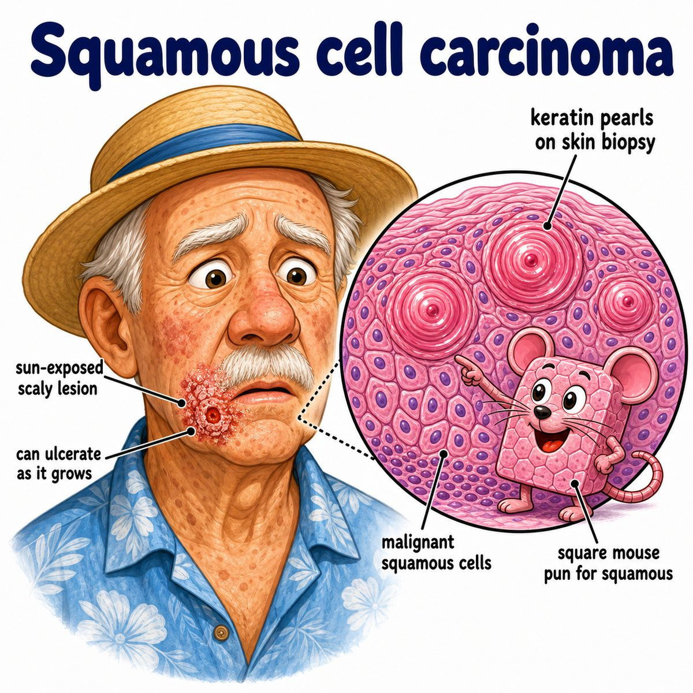

# Squamous cell carcinoma

Squamous cell carcinoma, or SCC (squamous cell carcinoma), is a malignant tumor of squamous cells.

Squamous cells are flat epithelial cells found in places like:

* skin epidermis
* oral cavity
* esophagus
* cervix
* anus
* bronchi/lung

Carcinoma means cancer from epithelial cells.

So:

> SCC = cancer made of abnormal squamous epithelial cells.

---

### Core idea

Squamous cells normally make keratin, especially in skin.

So SCC often tries to make keratin too, but in a disorganized cancer way.

That gives the classic histology finding:

* keratin pearls
* intercellular bridges

Keratin pearl = a round swirl of pink keratin made by malignant squamous cells.

---

### Why the findings happen

* **Scaly/crusted skin lesion:** squamous cells produce keratin
* **Firm red nodule or nonhealing ulcer:** cancer grows downward and disrupts normal epidermis
* **Keratin pearls on biopsy:** malignant squamous cells still partially remember their normal job, which is keratin production
* **Can invade/metastasize:** carcinoma is malignant, so it can break through the basement membrane and spread

---

### Common causes/risk factors

Big ones:

* UV (ultraviolet) light exposure
* fair skin
* immunosuppression
* chronic wounds or burns
* HPV (human papillomavirus), especially anogenital/oropharyngeal SCC
* smoking, especially lung SCC

UV causes DNA damage in epidermal cells, so repeated sun injury can push squamous cells toward cancer.

---

## One-line intuition

SCC is squamous epithelium turning malignant, so it often forms a scaly/keratinizing tumor with keratin pearls.

---

## Pearl 🔥

On Step 1, **keratin pearls + intercellular bridges = squamous cell carcinoma** until proven otherwise.