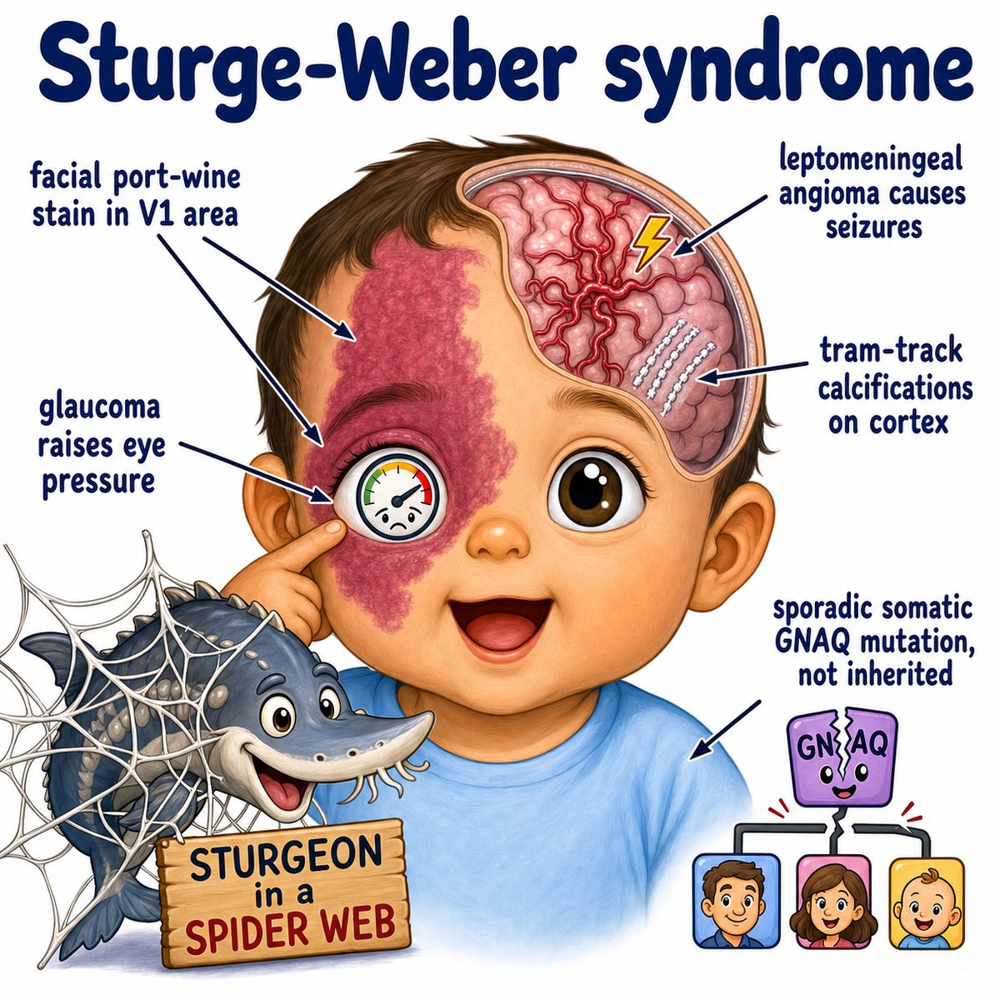
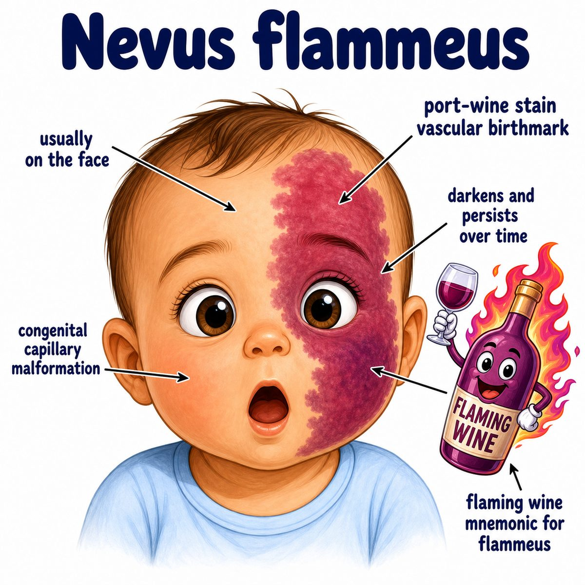

# Sturge-Weber syndrome

Sturge-Weber syndrome is a congenital neurocutaneous disorder.

Neurocutaneous means:

* neuro = nervous system
* cutaneous = skin

So this is a disorder where abnormal blood vessels affect:

* skin
* brain
* eye

---

### Classic triad

* Port-wine stain on the face
* Leptomeningeal angioma
* Glaucoma

Port-wine stain = flat red/purple birthmark from dilated capillaries (tiny blood vessels).

Leptomeningeal angioma = abnormal blood vessels in the leptomeninges (thin coverings of the brain).

Glaucoma = increased pressure inside the eye that can damage the optic nerve.

---

### Why the findings happen

There is abnormal vascular development, classically from a somatic GNAQ mutation.

Somatic means the mutation happens after fertilization, so only some cells have it.

That is why Sturge-Weber is usually sporadic, not inherited.

The abnormal vessels can involve the face, brain coverings, and eye:

* **Face:** dilated capillaries cause a port-wine stain
* **Brain:** leptomeningeal angiomas irritate/damage cortex, causing seizures
* **Brain over time:** poor blood flow can cause cortical atrophy and calcifications
* **Eye:** abnormal drainage/vascular changes can cause glaucoma

---

### Key imaging buzzword

Sturge-Weber is associated with:

* tram-track calcifications

These are gyriform cortical calcifications, meaning calcium deposits that follow the brain gyri (folds).

---

## One-line intuition

Sturge-Weber syndrome is a congenital blood vessel malformation syndrome where the same side of the face, brain, and eye can be affected together.

---

## Pearl 🔥

The port-wine stain classically involves the V1 distribution.

V1 = ophthalmic branch of trigeminal nerve (CN V), which covers the forehead/upper eyelid region.