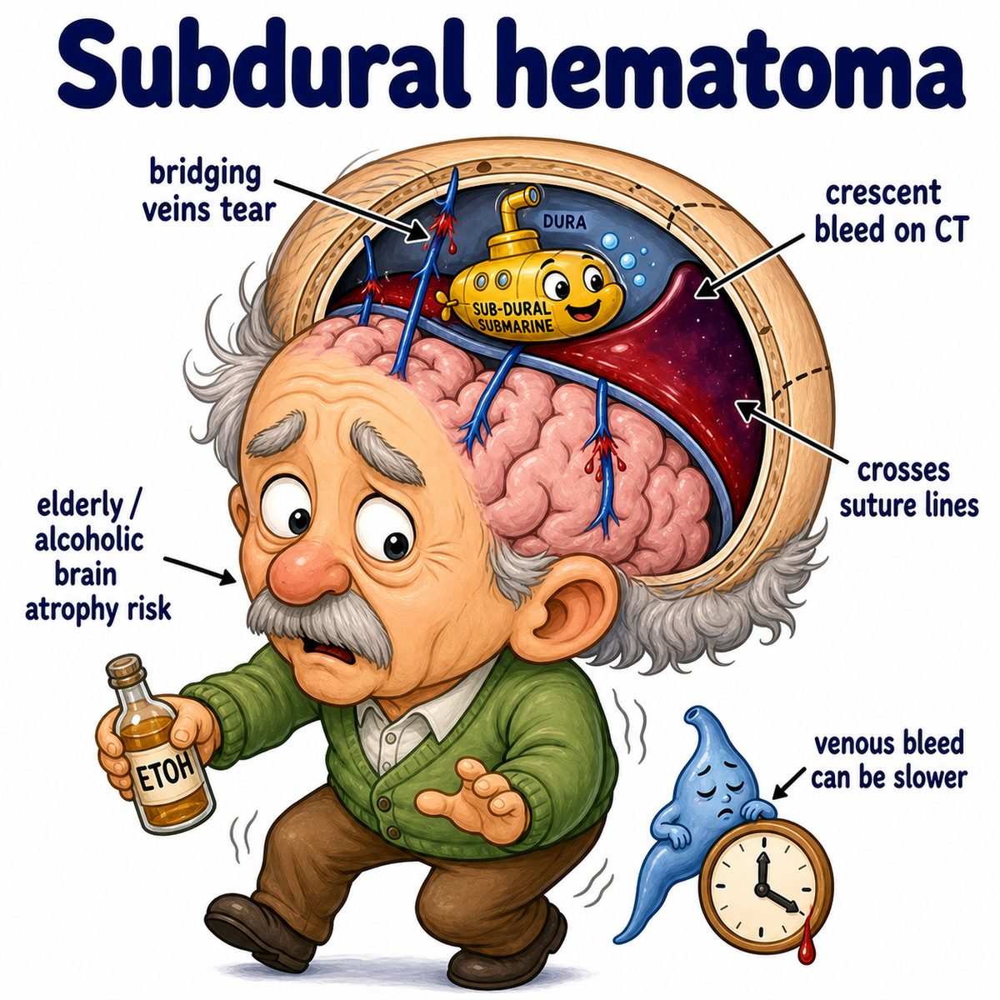

# Subdural hematoma

### Core idea

A subdural hematoma is blood collecting **under the dura mater**.

Dura mater = tough outer meningeal layer covering the brain.

So:

* sub- = under
* dural = dura mater
* hematoma = collection of blood

Subdural hematoma = blood between the **dura mater** and **arachnoid mater**.

---

### What vessel is injured?

Usually rupture of **bridging veins**.

Bridging veins are veins that travel from the brain surface to the dural venous sinuses (large venous drainage channels inside the dura mater).

The brain moves inside the skull after trauma, and those stretched veins can tear.

---

### Why it looks crescent-shaped

On CT (computed tomography), subdural hematomas classically look:

* crescent-shaped
* able to cross suture lines
* spread along the brain surface

Reason:

The blood is under the dura, so it can track broadly along the cerebral hemisphere.

Compare that with epidural hematoma, which is usually lens-shaped because blood is trapped between skull and dura.

---

### Who gets it?

Classic risk groups:

* elderly patients
* alcohol use disorder
* head trauma
* anticoagulation (blood thinner use)
* infants with abusive head trauma

Why elderly/alcohol use disorder?

Brain atrophy means the brain shrinks a bit away from the skull, stretching the bridging veins. More stretch = easier tearing.

---

### Symptoms

Can cause:

* headache
* confusion
* decreased consciousness
* focal neurologic deficits (weakness, aphasia, vision changes, etc.)
* increased ICP (intracranial pressure)

ICP = pressure inside the skull.

If the blood collection gets big, it compresses brain tissue and can cause midline shift.

Midline shift = the brain gets pushed away from the bleeding side.

---

## One-line intuition

Subdural hematoma is a **slow venous bleed from torn bridging veins**, spreading in a crescent under the dura.

---

## Pearl

Subdural hematoma = **bridging veins + crescent-shaped bleed**.

Epidural hematoma = **middle meningeal artery + lens-shaped bleed + lucid interval**.