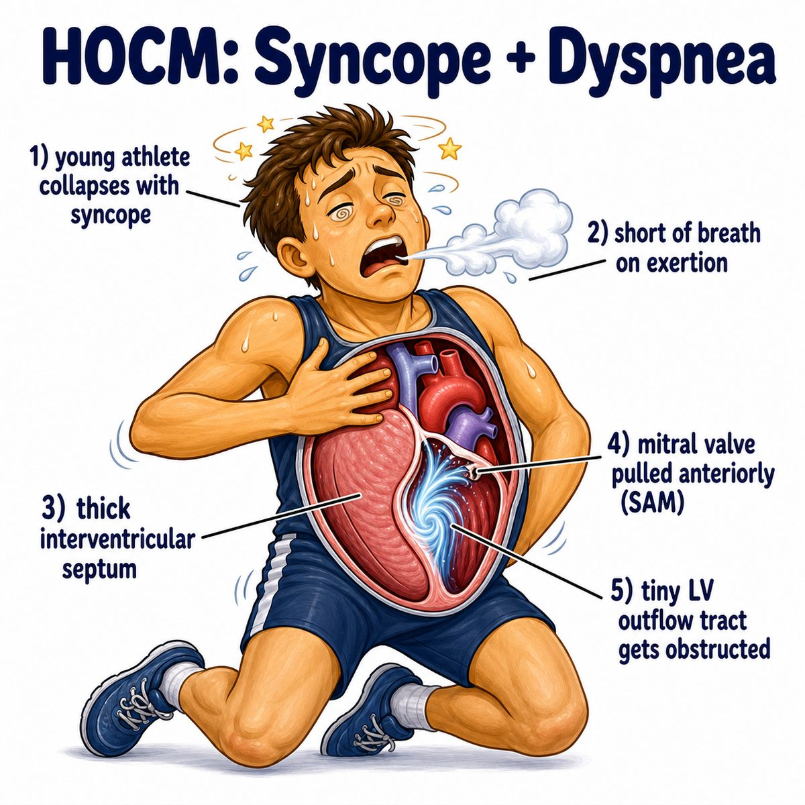

# Syncope

### Core idea

Syncope means fainting:

* sudden, brief loss of consciousness
* loss of postural tone
* quick recovery

The key mechanism is:

> not enough blood flow to the brain for a short time.

So syncope is basically transient cerebral hypoperfusion.

* transient = temporary
* cerebral = brain
* hypoperfusion = low blood flow

---

### Why it happens

Your brain needs constant blood flow.

If blood pressure drops too much, or the heart cannot pump effectively, the brain briefly gets under-perfused, so you pass out.

Common causes:

* **Vasovagal syncope:** vagus nerve reflex causes low HR (heart rate) and low BP (blood pressure)
* **Orthostatic syncope:** standing causes blood to pool in legs, so less blood returns to heart
* **Cardiac syncope:** arrhythmia (abnormal heart rhythm) or obstruction causes poor cardiac output

Cardiac output = amount of blood the heart pumps per minute.

---

### Vasovagal intuition

Vasovagal syncope is the classic “fainting after blood, needles, pain, emotion, heat, or standing too long.”

The body overreacts:

* more vagal tone
* slower HR
* more vasodilation
* lower BP
* less brain blood flow
* faint

Vasodilation = blood vessels widen, so pressure falls.

---

### Orthostatic intuition

When you stand up, gravity pulls blood into your legs.

Normally, your body compensates by:

* increasing sympathetic tone
* constricting blood vessels
* increasing HR slightly

Sympathetic tone = fight-or-flight nervous system activity.

If that response fails, BP drops and the brain gets less blood.

---

### Big Step 1 distinction

Syncope is not the same as seizure.

Syncope:

* low brain blood flow
* brief LOC (loss of consciousness)
* rapid recovery
* may have lightheadedness, tunnel vision, sweating, nausea

Seizure:

* abnormal electrical brain activity
* postictal confusion often lasts longer

Postictal = after a seizure.

---

## One-line intuition

Syncope is the brain briefly “turning off” because blood flow to it temporarily drops.

---

## Pearl 🔥

HY red flags for **cardiac syncope**:

* syncope during exertion
* syncope while lying down
* palpitations before fainting
* family history of sudden cardiac death

Those suggest an arrhythmia or structural heart problem, not simple vasovagal fainting.