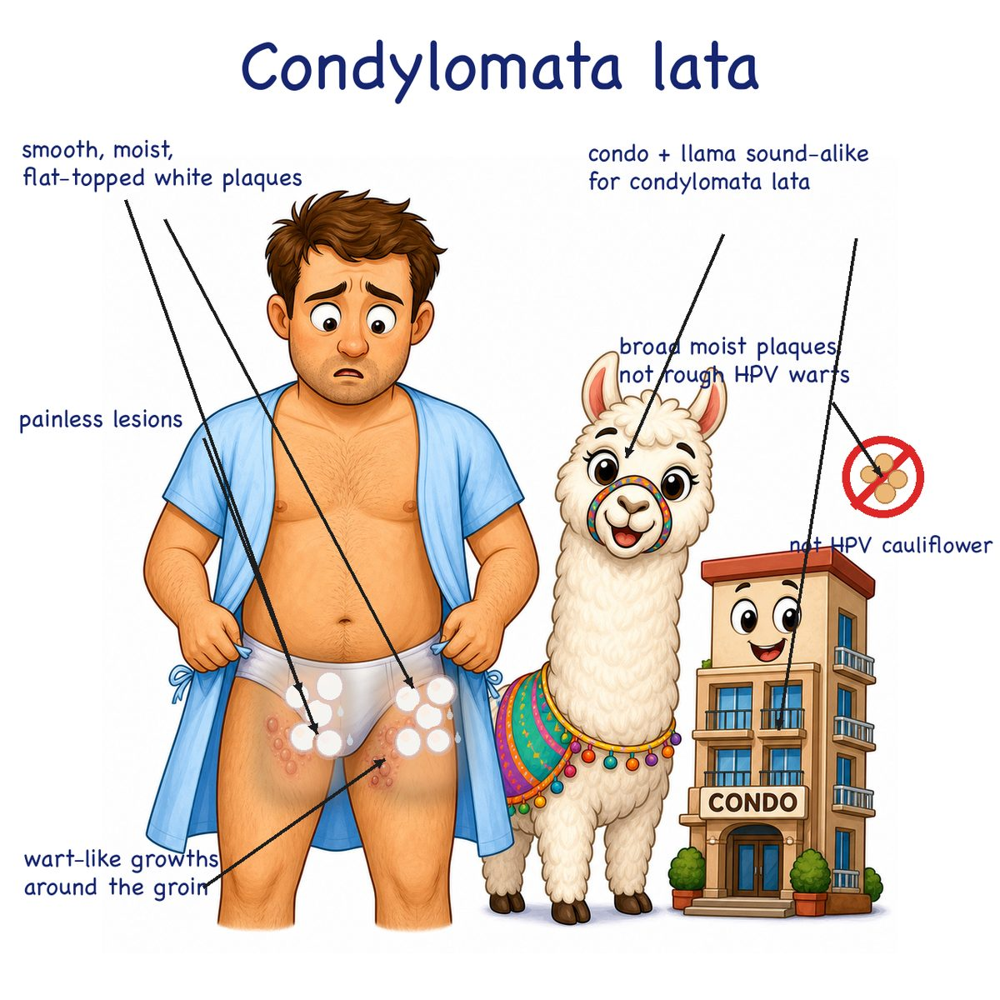
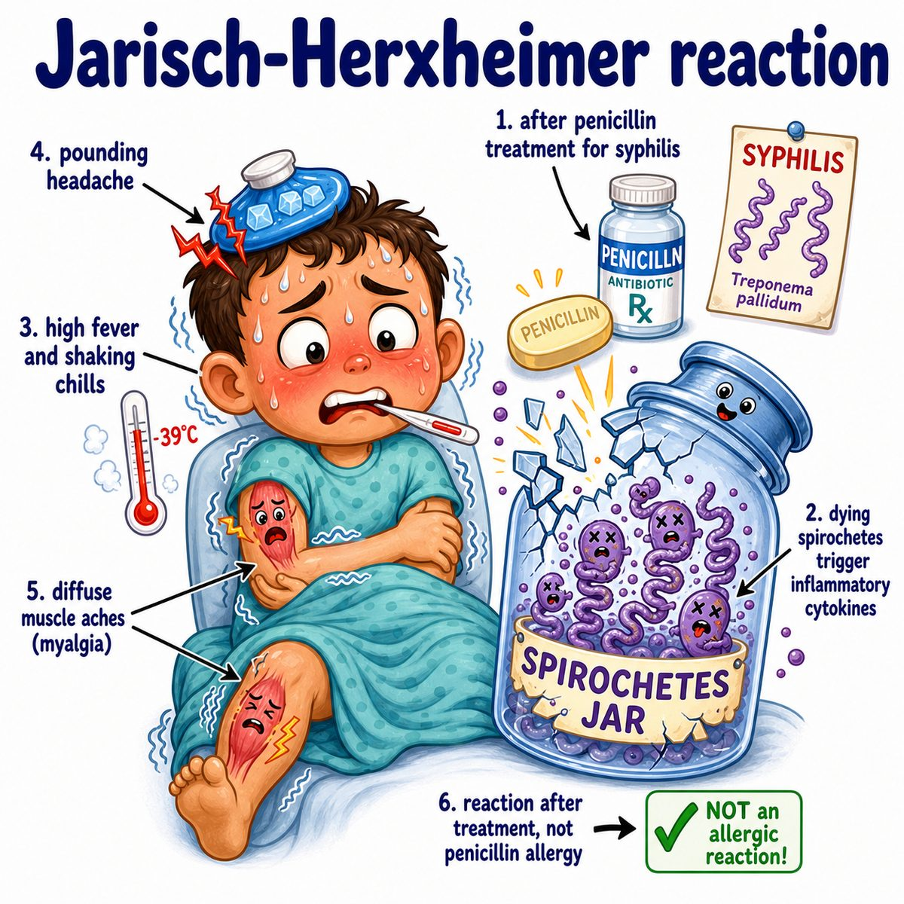

# Syphilis

Syphilis is a sexually transmitted infection caused by **Treponema pallidum**, a **spirochete** (spiral-shaped bacterium).

Break it down:

* **Treponema pallidum** = thin corkscrew bacteria
* **chancre** = painless ulcer
* **systemic infection** = can spread through the blood and affect many organs

---

### Core idea

Syphilis progresses in stages:

* **Primary:** painless chancre at the infection site
* **Secondary:** diffuse rash, classically including palms and soles
* **Latent:** no symptoms, but blood tests are positive
* **Tertiary:** destructive late disease involving brain, aorta, or gummas

**Gumma** means a soft granulomatous lesion (chronic immune cell collection that can destroy tissue).

---

### Why the findings happen

* **Painless chancre:** local invasion by spirochetes causes an ulcer, but not much pain
* **Palms/soles rash:** bacteria spread through the bloodstream, so skin findings become widespread
* **Condylomata lata:** broad, moist, wart-like secondary syphilis lesions full of organisms
* **Neurosyphilis:** bacteria can involve the central nervous system, meaning brain and spinal cord
* **Aortitis:** late inflammation of the vasa vasorum (small vessels feeding the aorta) weakens the aortic wall

---

### Testing

Screen with:

* **RPR** (rapid plasma reagin) or **VDRL** (Venereal Disease Research Laboratory test)

Confirm with:

* **FTA-ABS** (fluorescent treponemal antibody absorption test) or other treponemal tests

Intuition:

* **RPR/VDRL** track disease activity and treatment response
* **Treponemal tests** often stay positive for life

---

## One-line intuition

Syphilis is a corkscrew-shaped bacteria infection that starts as a painless ulcer, spreads to cause a palms/soles rash, then can hide and later damage the brain or aorta.

---

## Pearl 🔥

**Tertiary syphilis causes thoracic aortic aneurysm because it causes obliterative endarteritis of the vasa vasorum** (inflammation that narrows the tiny vessels supplying the aortic wall).