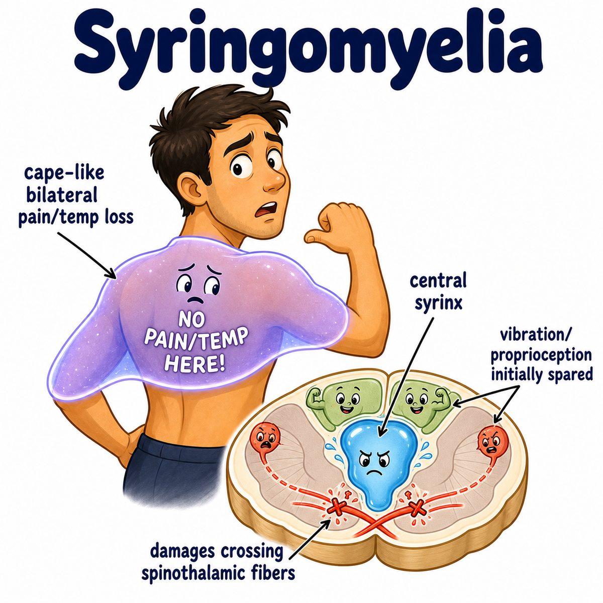

# Syringomyelia

Syringomyelia is a spinal cord disorder where a fluid-filled cavity forms inside the spinal cord.

That cavity is called a **syrinx** (fluid-filled cyst inside the spinal cord).

Most classic association:

* Chiari I malformation (cerebellar tonsils herniate downward through the foramen magnum)

Foramen magnum = big hole at the base of the skull where the brainstem/spinal cord passes through.

---

### Core idea

Normally, cerebrospinal fluid (CSF = fluid around the brain and spinal cord) flows around the outside of the spinal cord.

In syringomyelia, CSF gets trapped inside the cord and forms a syrinx.

So think:

> fluid bubble inside the spinal cord slowly expanding and damaging nearby fibers.

---

### Why the symptoms happen

The syrinx usually starts centrally in the spinal cord.

The first fibers hit are the crossing spinothalamic fibers.

Spinothalamic tract = pathway for pain and temperature.

These fibers cross near the central canal, so a central syrinx damages them early.

That causes:

* bilateral loss of pain and temperature
* classically in a cape-like or shawl-like distribution over shoulders/upper limbs

But dorsal columns are spared early.

Dorsal columns = pathway for vibration, proprioception (position sense), and fine touch.

So the weird classic pattern is:

* loss of pain/temp
* preserved vibration/position sense

This is called dissociated sensory loss.

---

### If it expands

If the syrinx gets bigger, it can hit:

* anterior horn cells → lower motor neuron weakness/atrophy in hands
* corticospinal tract → upper motor neuron signs below the lesion

Anterior horn cells = lower motor neuron cell bodies in the spinal cord.

Corticospinal tract = motor pathway from brain to spinal cord.

---

## One-line intuition

Syringomyelia is a CSF-filled hole in the middle of the spinal cord that first knocks out crossing pain/temp fibers.

---

## Pearl 🔥

Syringomyelia classically causes bilateral loss of pain and temperature in a cape-like distribution because it damages crossing spinothalamic fibers near the anterior white commissure.