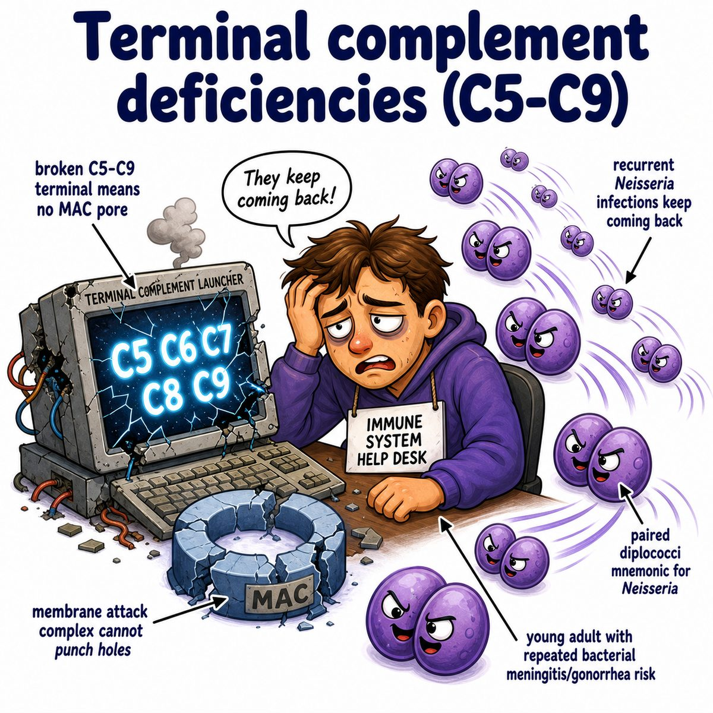

# Terminal complement deficiency

Terminal complement deficiency means a deficiency in the late complement proteins:

* C5
* C6
* C7
* C8
* C9

These normally form the MAC (membrane attack complex), which punches holes in bacterial membranes.

So if C5-C9 are missing:

* complement can still tag bacteria somewhat
* but it cannot form the final pore
* bacteria are not lysed well

---

### Core association

Terminal complement deficiency classically causes recurrent Neisseria infections, especially:

* Neisseria meningitidis
* Neisseria gonorrhoeae

Neisseria are gram-negative diplococci (paired round bacteria that stain pink/red on Gram stain).

---

### Why Neisseria specifically?

Neisseria are especially vulnerable to killing by the MAC (membrane attack complex).

Normally:

* complement activates
* C5b starts the terminal pathway
* C6-C9 assemble
* MAC forms a pore
* Neisseria gets lysed

In terminal complement deficiency:

* no proper MAC
* no pore
* Neisseria survives

---

### Test clue

CH50 (total classical complement activity test) is low/absent because the full pathway cannot complete.

AH50 (alternative pathway hemolytic activity test) can also be low/absent because both classical and alternative pathways eventually need C5-C9.

---

## One-line intuition

Terminal complement deficiency = the immune system can aim at bacteria, but cannot fire the final membrane-punching weapon.

---

## Pearl 🔥

C5-C9 deficiency = recurrent Neisseria infections.

C3 deficiency is worse overall because C3 is needed for opsonization (coating microbes so phagocytes can eat them), so it causes severe recurrent pyogenic infections.