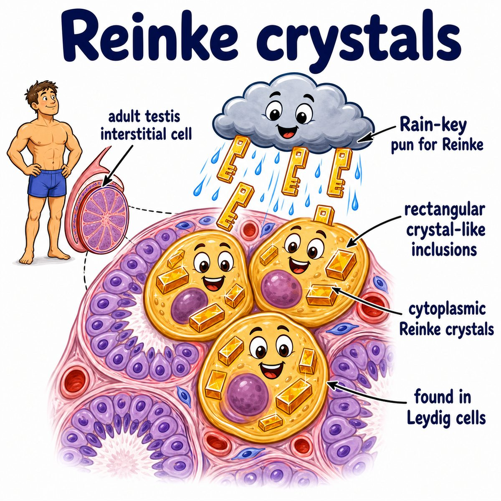

# Testicular cancer

Testicular cancer is a malignant tumor of the testis, usually arising from **germ cells** (sperm-forming cells).

Most Step 1 testicular cancers are **germ cell tumors**, divided into:

* **Seminomas:** more uniform, radiosensitive, often painless testicular mass
* **Nonseminomatous germ cell tumors:** embryonal carcinoma, yolk sac tumor, choriocarcinoma, teratoma, or mixed tumors

---

### Core idea

A testicular germ cell becomes malignant and grows inside the testis, usually presenting as a:

* painless testicular mass
* firm enlarged testis
* sometimes dull ache or heaviness

Pain can happen, but painless mass is the classic board-style clue.

---

### Why the findings happen

* **Painless mass:** tumor expands within the testicular tissue
* **Ultrasound mass:** testicular tumors are usually solid intratesticular lesions
* **Retroperitoneal spread:** testes originally develop high in the abdomen, so lymph drainage goes to para-aortic lymph nodes
* **Tumor markers:** different germ cell tumors make embryonic/fetal proteins or hormones

Important markers:

* **AFP (alpha-fetoprotein):** yolk sac tumor, embryonal carcinoma
* **beta-hCG (beta-human chorionic gonadotropin):** choriocarcinoma, sometimes seminoma
* **LDH (lactate dehydrogenase):** tumor burden marker

Key trick:

* pure seminoma usually does **not** increase AFP
* if AFP is elevated, think nonseminomatous component

---

### Major types

* **Seminoma:** classic in young adults, large cells with clear cytoplasm, very radiosensitive
* **Yolk sac tumor:** most common testicular tumor in children, AFP positive, Schiller-Duval bodies
* **Embryonal carcinoma:** aggressive, AFP and/or beta-hCG can be elevated
* **Choriocarcinoma:** very high beta-hCG, hematogenous spread, can cause gynecomastia
* **Teratoma:** can be benign in children, malignant in adults

---

## One-line intuition

Testicular cancer is usually a germ cell tumor, and the tumor markers tell you what kind of embryologic tissue the tumor is trying to mimic.

---

## Pearl 🔥

Testicular cancer spreads first to **para-aortic lymph nodes**, not inguinal lymph nodes, because the testes embryologically descend from the posterior abdominal wall.