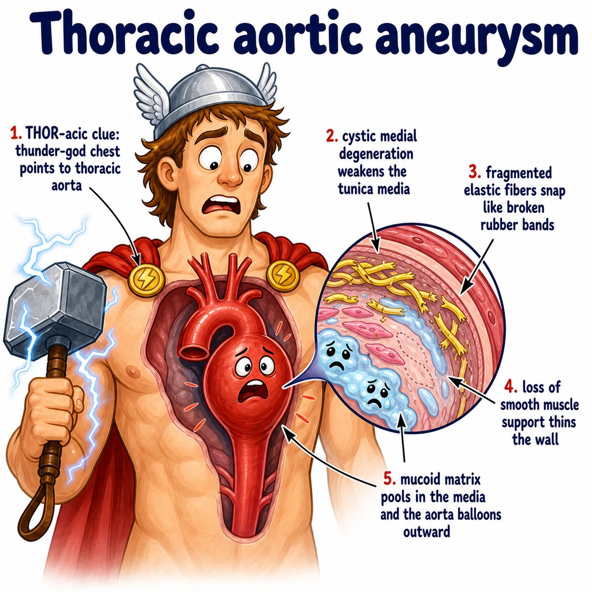
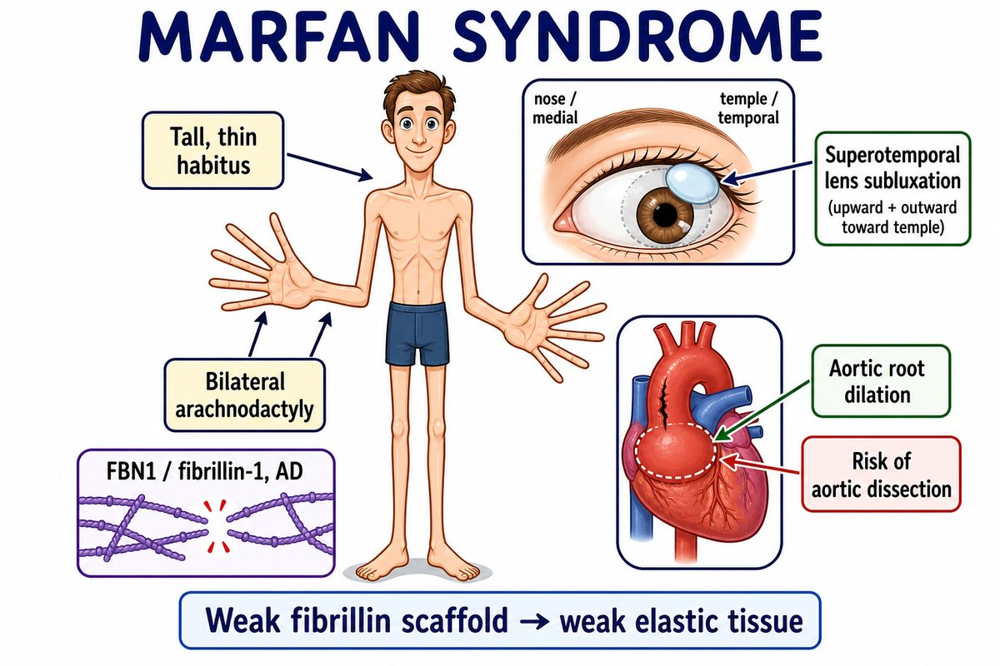

# Thoracic aortic aneurysm

A thoracic aortic aneurysm is abnormal dilation/ballooning of the thoracic aorta (the part of the aorta in the chest).

Break it down:

* thoracic = chest
* aortic = involving the aorta (main artery leaving the heart)
* aneurysm = weakened, dilated vessel wall

So:

> the aorta in the chest gets weak and balloons outward.

---

### Core idea

The aortic wall is supposed to be strong and elastic.

If the wall weakens, blood pressure pushes outward on it over time, causing dilation.

The danger is:

* rupture = vessel bursts
* dissection = blood tears into the vessel wall layers
* compression symptoms = enlarged aorta presses on nearby structures

---

### Why it happens

Common causes/risk factors:

* hypertension (high blood pressure)
* atherosclerosis (plaque buildup in arteries)
* Marfan syndrome
* Ehlers-Danlos syndrome
* bicuspid aortic valve (aortic valve has 2 cusps instead of 3)
* tertiary syphilis

Why these matter:

* hypertension increases outward pressure on the aortic wall
* connective tissue diseases weaken elastic tissue
* syphilis damages the vasa vasorum (small blood vessels that supply large vessel walls)

---

### Symptoms

Often asymptomatic (no symptoms) until large.

Possible symptoms:

* chest pain
* back pain
* cough
* hoarseness
* shortness of breath
* dysphagia (difficulty swallowing)

Hoarseness can happen because the enlarged aorta can compress the recurrent laryngeal nerve (nerve that helps control the vocal cords).

---

## One-line intuition

Thoracic aortic aneurysm = weak chest aorta wall slowly balloons out under pressure, risking rupture or dissection.

---

## Pearl 🔥

Tertiary syphilis causes thoracic aortic aneurysm by obliterative endarteritis (inflammation/narrowing of small arteries) of the vasa vasorum, weakening the aortic media (middle vessel wall layer).