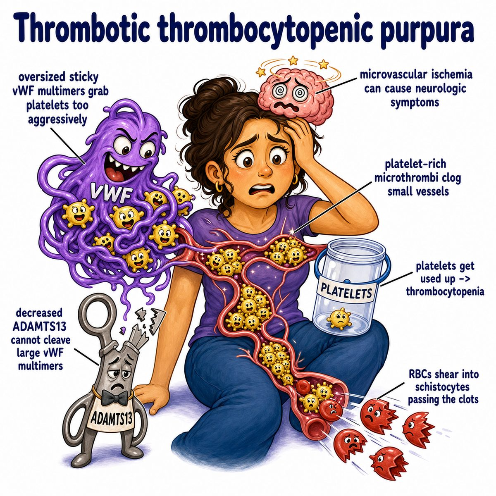

# Thrombotic thrombocytopenic purpura

Thrombotic thrombocytopenic purpura (TTP) is a thrombotic microangiopathy (small-vessel clotting disease) where tiny platelet clots form throughout the body.

Break the name apart:

* thrombotic = clots are forming
* thrombocytopenic = low platelets
* purpura = purple skin spots/bruising from bleeding under the skin

Core problem:

* low ADAMTS13 (a disintegrin and metalloprotease with thrombospondin type 1 motif, member 13)
* ADAMTS13 normally cuts von Willebrand factor (VWF, a platelet-binding clotting protein)
* if ADAMTS13 is missing, giant VWF strings stay around
* platelets stick to them
* small-vessel platelet clots form

So platelets are being used up in clots:

* thrombocytopenia (low platelet count)
* petechiae/purpura (tiny bleeding spots/bruises)

And red blood cells (RBCs, red blood cells) get shredded as they pass through the small clotted vessels:

* microangiopathic hemolytic anemia (MAHA, red blood cell destruction from small-vessel injury)
* schistocytes (fragmented RBCs) on blood smear
* increased lactate dehydrogenase (LDH, marker of cell breakdown)
* decreased haptoglobin (protein that binds free hemoglobin)

Classic findings:

* thrombocytopenia
* MAHA with schistocytes
* neurologic symptoms
* kidney injury
* fever

But for Step 1, the big pattern is:

> low platelets + hemolytic anemia + schistocytes + neurologic symptoms = think TTP.

Why neurologic symptoms happen:

Tiny platelet clots block brain microvessels, causing transient ischemia (low blood flow), so patients can have confusion, headache, seizures, or focal deficits.

Treatment idea:

Plasma exchange removes the anti-ADAMTS13 antibodies and gives functional ADAMTS13 back.

## One-line intuition

TTP is when ADAMTS13 is too low, so VWF gets too sticky, platelets make small-vessel clots, and RBCs get sliced into schistocytes.

## Pearl 🔥

Do **not** give platelet transfusions in suspected TTP unless there is life-threatening bleeding, because platelets can feed the microthrombi (tiny clots).