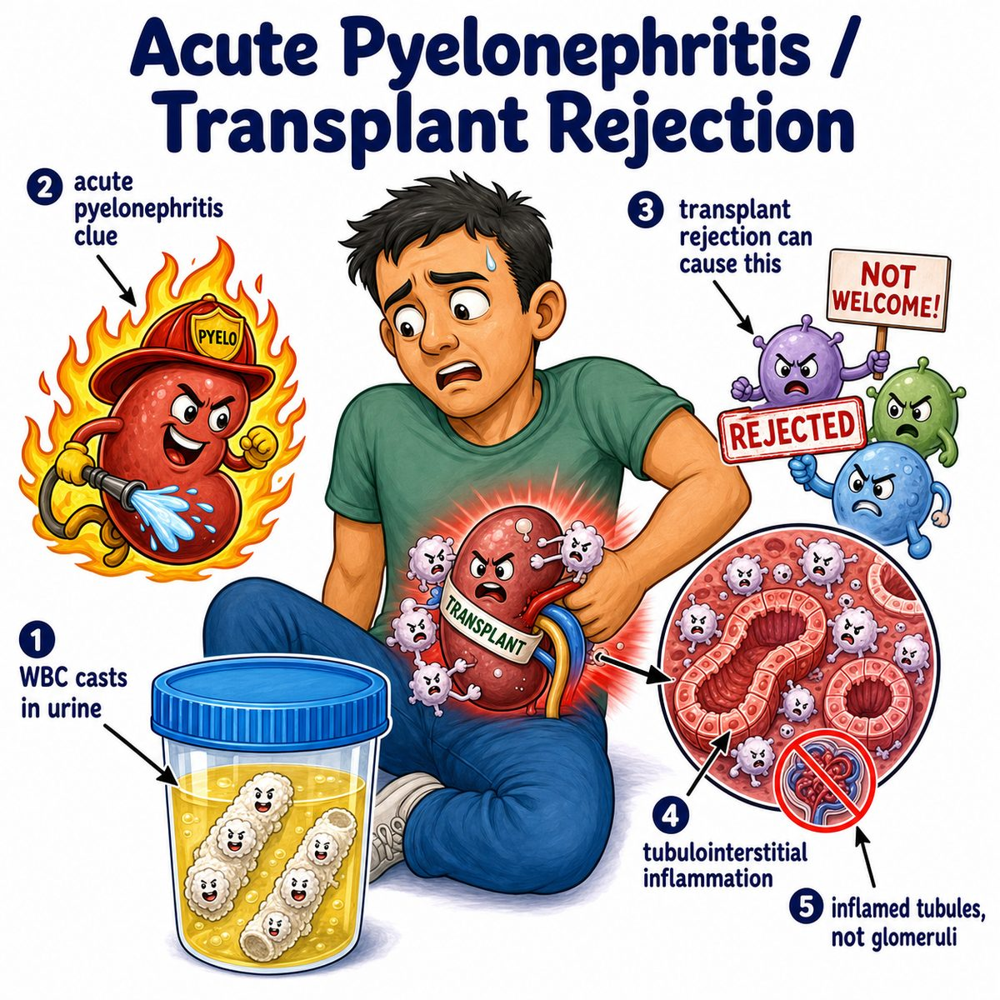

# Transplant rejection

### Core idea

Transplant rejection = the recipient's immune system attacks the transplanted organ because it sees it as foreign.

The big issue is mismatch in:

* **HLA** (human leukocyte antigen)
* **MHC** (major histocompatibility complex)

These are basically cellular "ID badges."

If the donor organ has different ID badges, the recipient's immune system says:

> this is not me.

Then immune cells attack the graft (transplanted tissue).

---

### Why rejection happens

The donor organ contains cells with donor HLA/MHC proteins.

Recipient **T cells** (T lymphocytes, immune cells that recognize antigens) can recognize these donor HLA/MHC molecules as foreign.

That activates:

* **CD8 T cells** (cytotoxic T cells that kill cells)
* **CD4 T cells** (helper T cells that coordinate immune responses)
* sometimes **antibodies** (immune proteins that bind targets)

So the graft gets inflamed, injured, and can stop working.

---

### Types of rejection

**Hyperacute rejection**

Happens within minutes to hours.

Cause:

* preformed antibodies already exist against donor antigens

Classic triggers:

* ABO blood group mismatch
* prior pregnancy
* prior transfusion
* prior transplant

Mechanism:

* antibodies bind graft endothelium (blood vessel lining)
* complement (immune protein cascade) activates
* thrombosis (clotting) happens
* graft becomes ischemic (low blood flow) and dies fast

---

**Acute rejection**

Happens days to weeks, but can happen later if immunosuppression is reduced.

Two main forms:

* **acute cellular rejection:** T cells attack graft cells
* **acute antibody-mediated rejection:** antibodies attack graft vessels

In kidney transplant, this can show:

* rising creatinine (worse kidney filtration marker)
* tubulitis (inflammation inside kidney tubules)
* interstitial inflammation (inflammation between tubules)
* C4d staining in peritubular capillaries in antibody-mediated rejection

---

**Chronic rejection**

Happens months to years.

Think slow scarring and vessel narrowing.

Mechanism:

* chronic immune injury to graft blood vessels
* fibrosis (scar tissue formation)
* progressive loss of graft function

One-line pattern:

* acute = inflammatory attack
* chronic = slow vascular narrowing + fibrosis

---

## One-line intuition

The transplanted organ carries someone else's cellular ID, so the recipient's immune system may treat the graft like an invader and damage it.

---

## Pearl 🔥

Hyperacute rejection is a **type II hypersensitivity reaction** (antibody-mediated immune reaction against cell-surface antigens) because preformed antibodies bind donor endothelium and activate complement.