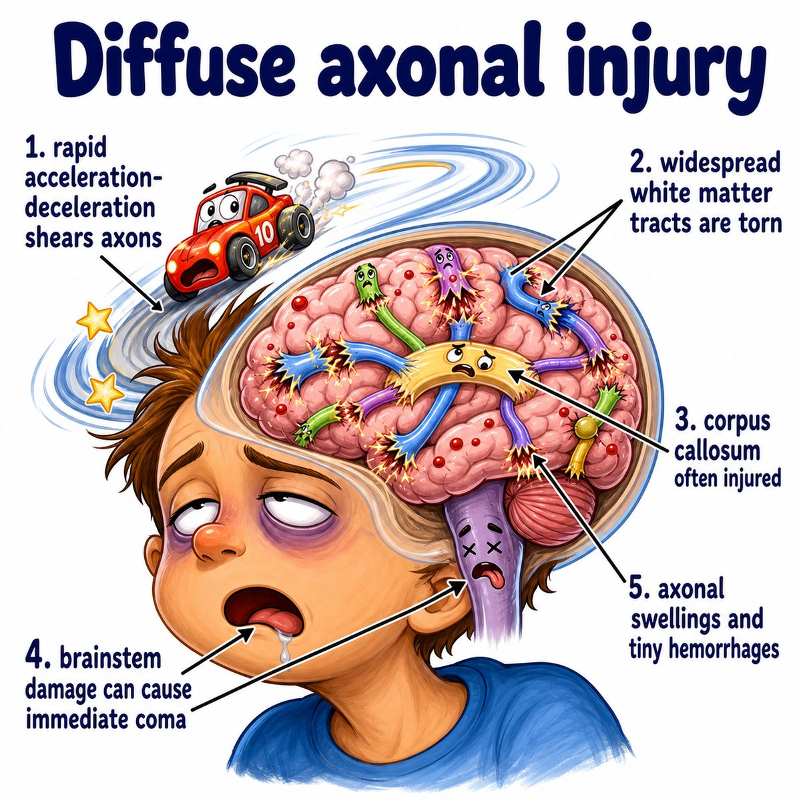

# Traumatic brain injury

Traumatic brain injury, or **TBI (traumatic brain injury)**, means brain dysfunction caused by an external force, like:

* fall
* car crash
* sports hit
* assault
* blast injury

Basically:

> the skull gets hit or rapidly moved, and the brain gets bruised, stretched, compressed, or bleeds.

---

### Core idea

The brain is soft and floats inside the skull.

So trauma can injure it by:

* direct impact
* brain bouncing inside the skull
* rotational/shearing forces
* bleeding that increases pressure

---

### Why the findings happen

* **Loss of consciousness:** sudden disruption of brain signaling
* **Confusion/amnesia:** injury to cortical networks and hippocampal memory circuits
* **Headache/vomiting:** increased ICP (intracranial pressure) or meningeal irritation
* **Focal neurologic deficits:** a specific injured brain region stops working normally
* **Seizures:** damaged cortex becomes electrically irritable

---

### Coup vs contrecoup

**Coup injury** = brain injury at the site of impact.

**Contrecoup injury** = brain injury on the opposite side.

Why?

The head stops suddenly, but the brain keeps moving briefly and hits the inside of the skull.

So:

* front hit → frontal coup injury
* brain rebounds backward → occipital contrecoup injury

---

### Big Step 1 mechanisms

**Diffuse axonal injury, or DAI (diffuse axonal injury):**

* caused by rotational acceleration/deceleration
* axons get stretched/sheared
* classically causes coma after trauma

Intuition:

> the brain wiring gets pulled apart, so communication across the brain shuts down.

**Epidural hematoma** = bleeding between skull and dura mater (tough outer meningeal layer).

Classic:

* middle meningeal artery tear
* temporal bone fracture
* lucid interval, then rapid decline

**Subdural hematoma** = bleeding between dura mater and arachnoid mater (middle meningeal layer).

Classic:

* bridging vein tear
* elderly or alcohol use disorder
* crescent-shaped bleed on CT (computed tomography)

---

## One-line intuition

TBI is when mechanical force damages brain tissue directly or causes bleeding/swelling that secondarily compresses the brain.

---

## Pearl 🔥

Epidural hematoma is usually **arterial** and lens-shaped; subdural hematoma is usually **venous** and crescent-shaped.