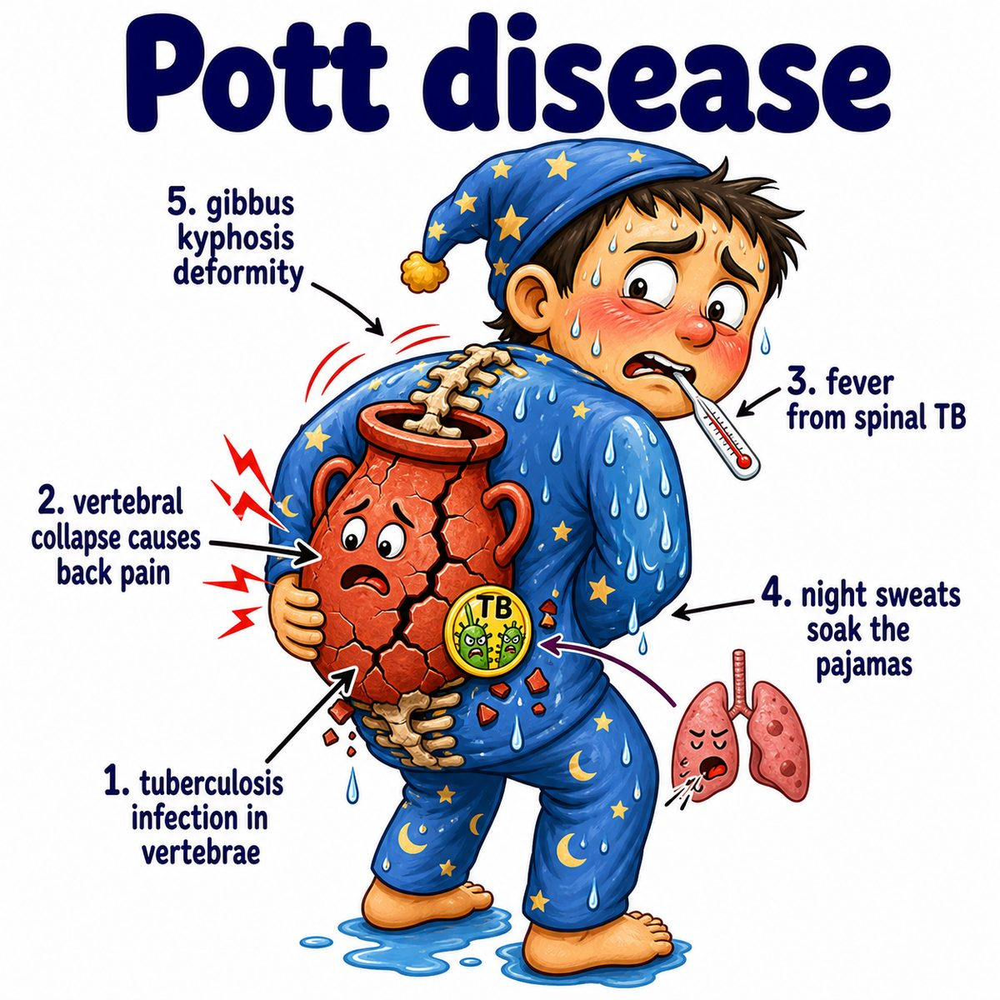

# Tuberculous spondylitis

Tuberculous spondylitis = tuberculosis (TB; infection by *Mycobacterium tuberculosis*) of the spine.

It is also called **Pott disease**.

Break it down:

* **tuberculous** = caused by TB
* **spondylitis** = inflammation/infection of vertebrae (spine bones)

So this means:

> TB infects the vertebral bodies and can destroy/collapse them.

---

### Core idea

TB usually spreads hematogenously (through the blood) from another site, often the lungs, to the spine.

It classically involves the:

* lower thoracic spine
* upper lumbar spine

The infection tends to start in the anterior vertebral body and can spread to adjacent vertebrae and the intervertebral disc (disc between spine bones).

---

### Why the findings happen

* **Back pain:** TB causes chronic inflammation in the vertebral body
* **Vertebral destruction/collapse:** granulomatous inflammation (macrophage-heavy immune reaction) damages bone
* **Kyphosis/gibbus deformity:** anterior vertebral bodies collapse, so the spine bends forward sharply
* **Cold abscess:** pus collection forms with less redness/heat than typical bacterial abscesses
* **Neurologic deficits/paraplegia:** collapsed bone or abscess compresses the spinal cord

Intuition:

TB slowly eats away the front of the vertebral bodies, so the spine caves forward and can pinch the spinal cord.

---

### Classic Step 1 clue

Think **Pott disease** when you see:

* history of TB or TB risk
* chronic back pain
* fever/night sweats/weight loss
* vertebral body destruction
* paraspinal or psoas abscess
* kyphotic deformity

---

## One-line intuition

Tuberculous spondylitis is TB in the spine causing slow vertebral destruction, collapse, kyphosis, abscess, and possible spinal cord compression.

---

## Pearl 🔥

Pott disease is an extrapulmonary TB (TB outside the lungs) manifestation, and spinal cord compression can cause **Pott paraplegia**.