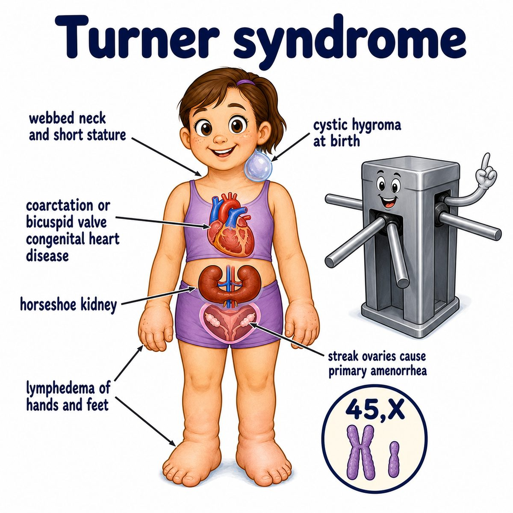

# Turner syndrome

### Core idea

Turner syndrome is a chromosomal disorder where a phenotypic female has loss of all or part of one X chromosome.

Classic karyotype:

* 45,X

Meaning:

* 45 = total chromosomes
* X = only one sex chromosome
* missing second X chromosome

So instead of XX, think:

> one X is missing or abnormal.

---

### Classic findings

* short stature
* webbed neck
* shield chest with widely spaced nipples
* streak ovaries
* primary amenorrhea
* infertility
* congenital heart disease, especially coarctation of the aorta
* horseshoe kidney

Definitions:

* primary amenorrhea = no first menstrual period
* infertility = inability to become pregnant
* coarctation = narrowing
* horseshoe kidney = fused kidneys

---

### Why the findings happen

The missing X chromosome causes abnormal development of several tissues.

Big Step 1 mechanism:

* loss of SHOX gene activity

SHOX gene = short stature homeobox gene, important for bone growth.

So:

* less SHOX gene dosage -> short stature

The ovaries become:

* streak ovaries

Streak ovaries = fibrous, underdeveloped ovaries that do not make enough estrogen.

So hormone pattern is:

* low estrogen
* high FSH (follicle-stimulating hormone)
* high LH (luteinizing hormone)

Why high FSH/LH?

Because the pituitary is yelling at the ovaries to work, but the ovaries cannot respond well.

---

### Why webbed neck happens

Turner syndrome can cause abnormal lymphatic development.

Lymphatic system = drainage system for extra fluid.

If lymph drainage is abnormal in fetal life:

* fluid collects in the neck
* cystic hygroma can form
* after it resolves, extra neck skin remains

That gives:

* webbed neck
* low posterior hairline

---

### One-line intuition

Turner syndrome is “missing X chromosome in a phenotypic female,” causing short stature, streak ovaries, infertility, webbed neck, and heart/kidney defects.

---

## Pearl

Turner syndrome is associated with preductal coarctation of the aorta and bicuspid aortic valve.

Contrast:

* Turner syndrome = 45,X female
* Klinefelter syndrome = 47,XXY male