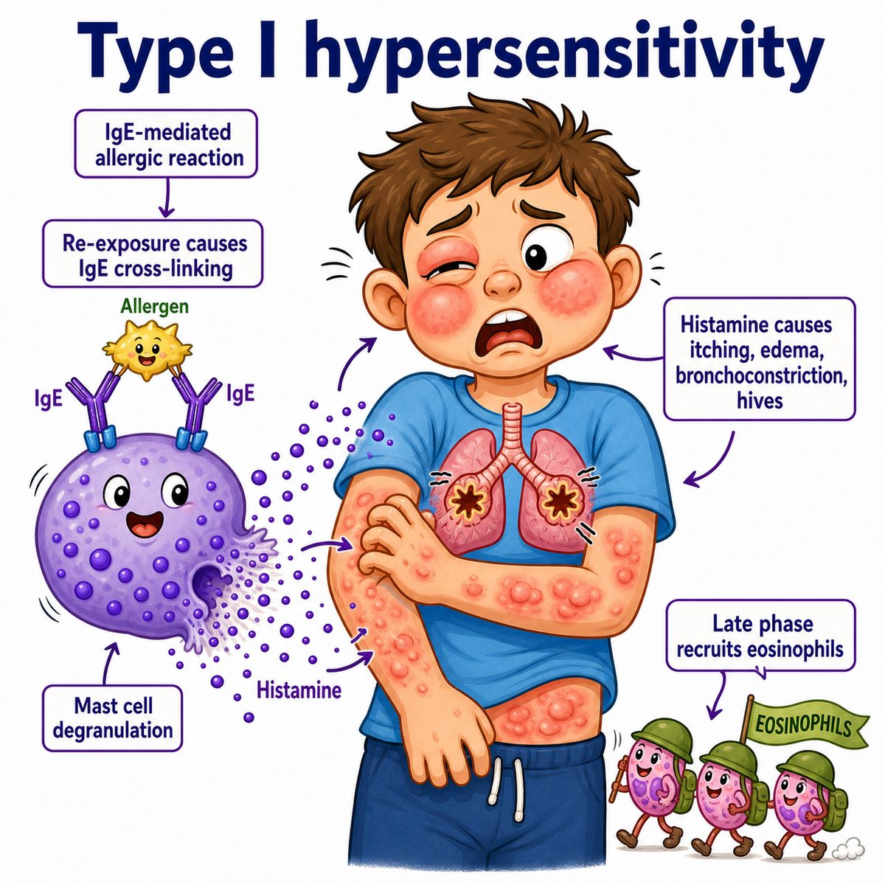

# Type I hypersensitivity

Type I hypersensitivity is an **immediate allergic reaction** mediated by **IgE (immunoglobulin E)**.

Classic examples:

* anaphylaxis
* asthma
* allergic rhinitis
* urticaria (hives)
* eczema/atopic dermatitis

---

### Core mechanism

First exposure:

* allergen enters body
* TH2 cells (T helper 2 cells) release IL-4 (interleukin-4)
* B cells class-switch to IgE (immunoglobulin E)
* IgE binds mast cells

This is called **sensitization**.

Second exposure:

* same allergen comes back
* allergen cross-links IgE on mast cells
* mast cells degranulate
* histamine, leukotrienes, and prostaglandins are released

So the key phrase is:

> IgE-mediated mast cell degranulation.

---

### Why the symptoms happen

Histamine causes:

* vasodilation → redness
* increased vascular permeability → swelling/hives
* itchiness → nerve stimulation
* bronchoconstriction → wheezing/asthma symptoms
* mucus secretion → runny nose

Leukotrienes cause:

* bronchoconstriction
* mucus production

This is why type I reactions can look like allergies in mild cases, but anaphylaxis in severe systemic cases.

---

### Timing

Type I is **immediate**.

Symptoms usually happen within minutes after re-exposure.

There can also be a late-phase reaction hours later due to eosinophils.

---

## One-line intuition

The body makes IgE “tripwires” on mast cells, and when the allergen returns, the mast cell dumps histamine everywhere.

---

## Pearl 🔥

Type I hypersensitivity is the only hypersensitivity type classically mediated by **IgE (immunoglobulin E)**.