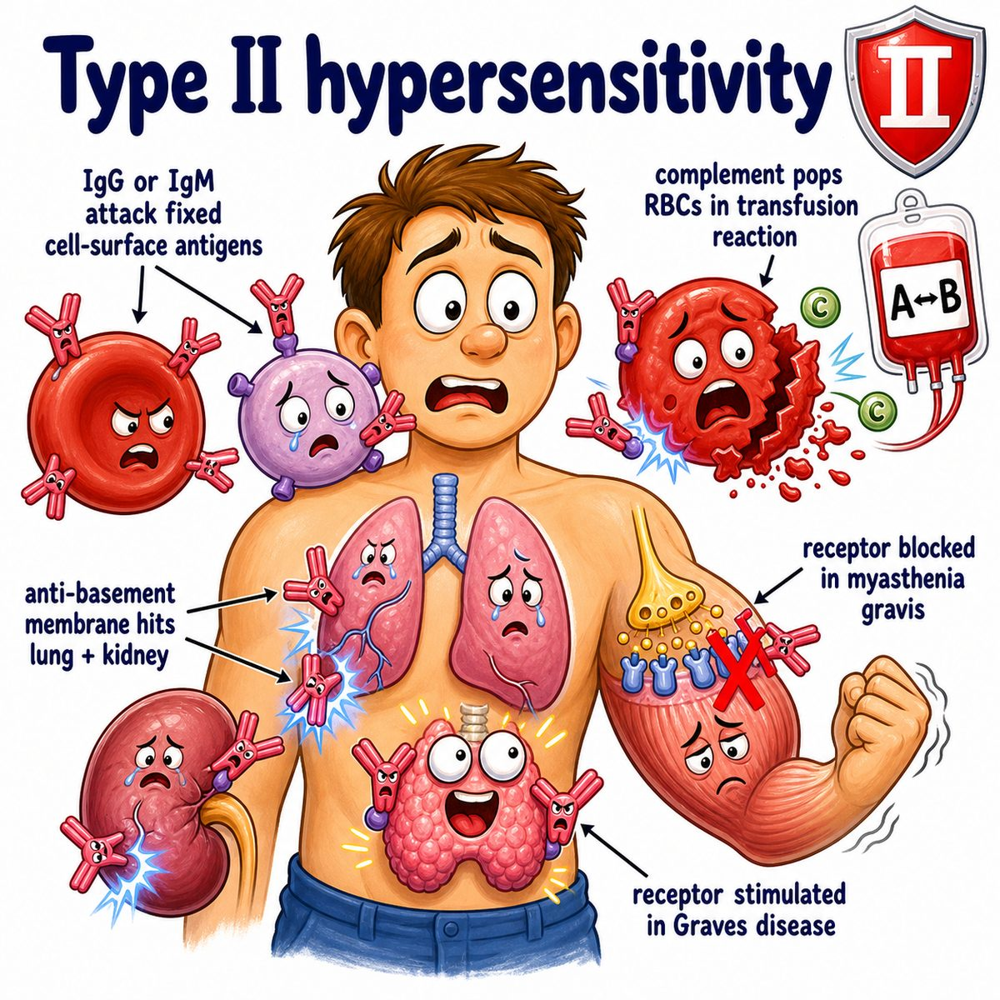

# Type II hypersensitivity

### Core idea

Type II hypersensitivity is **antibody-mediated damage against a fixed target**.

Usually:

* **IgG** (immunoglobulin G)
* **IgM** (immunoglobulin M)

bind to antigens (immune targets) sitting on:

* cell surfaces
* receptors
* basement membranes (thin support layers under tissues)

So think:

> antibodies attack something attached to a cell or tissue.

---

### What happens after antibody binds?

The antibody can cause disease in 3 main ways:

* **Complement activation**: complement proteins punch holes or inflame tissue
* **Opsonization**: antibodies tag cells so macrophages (immune-eating cells) destroy them
* **Receptor dysfunction**: antibodies block or stimulate receptors

So type II does **not always mean cell lysis**.

Sometimes it means:

* cell destruction, like autoimmune hemolytic anemia
* tissue injury, like Goodpasture syndrome
* receptor blockade, like myasthenia gravis
* receptor stimulation, like Graves disease

---

### Classic examples

* **Autoimmune hemolytic anemia**: antibodies bind RBCs (red blood cells) -> RBC destruction
* **Immune thrombocytopenia**: antibodies bind platelets -> platelet destruction
* **Goodpasture syndrome**: antibodies bind type IV collagen (basement membrane collagen) in kidney/lung -> hematuria (blood in urine) + hemoptysis (coughing blood)
* **Myasthenia gravis**: antibodies block ACh receptors (acetylcholine receptors) -> weak muscle contraction
* **Graves disease**: antibodies stimulate TSH receptor (thyroid-stimulating hormone receptor) -> hyperthyroidism
* **Acute hemolytic transfusion reaction**: recipient antibodies attack donor RBCs

---

### Why it is different from type III

Type II:

* antibody binds a **fixed target**
* target is stuck on a cell, receptor, or basement membrane

Type III hypersensitivity:

* antibody-antigen complexes float around first
* then they deposit in tissues

One-line difference:

> Type II = antibody attacks the wall. Type III = immune complexes get stuck in the wall.

---

### Quick intuition

Type II hypersensitivity is like putting a red flag directly on a cell/tissue target.

Then the immune system sees that flag and either:

* destroys it
* inflames it
* blocks its receptor
* overstimulates its receptor

---

## One-line intuition

Type II hypersensitivity = **IgG or IgM against cell-surface or tissue-fixed antigens**.

---

## Pearl

Direct Coombs test (direct antiglobulin test) detects antibodies or complement already stuck to RBCs, so it is high yield for autoimmune hemolytic anemia, a classic type II hypersensitivity.