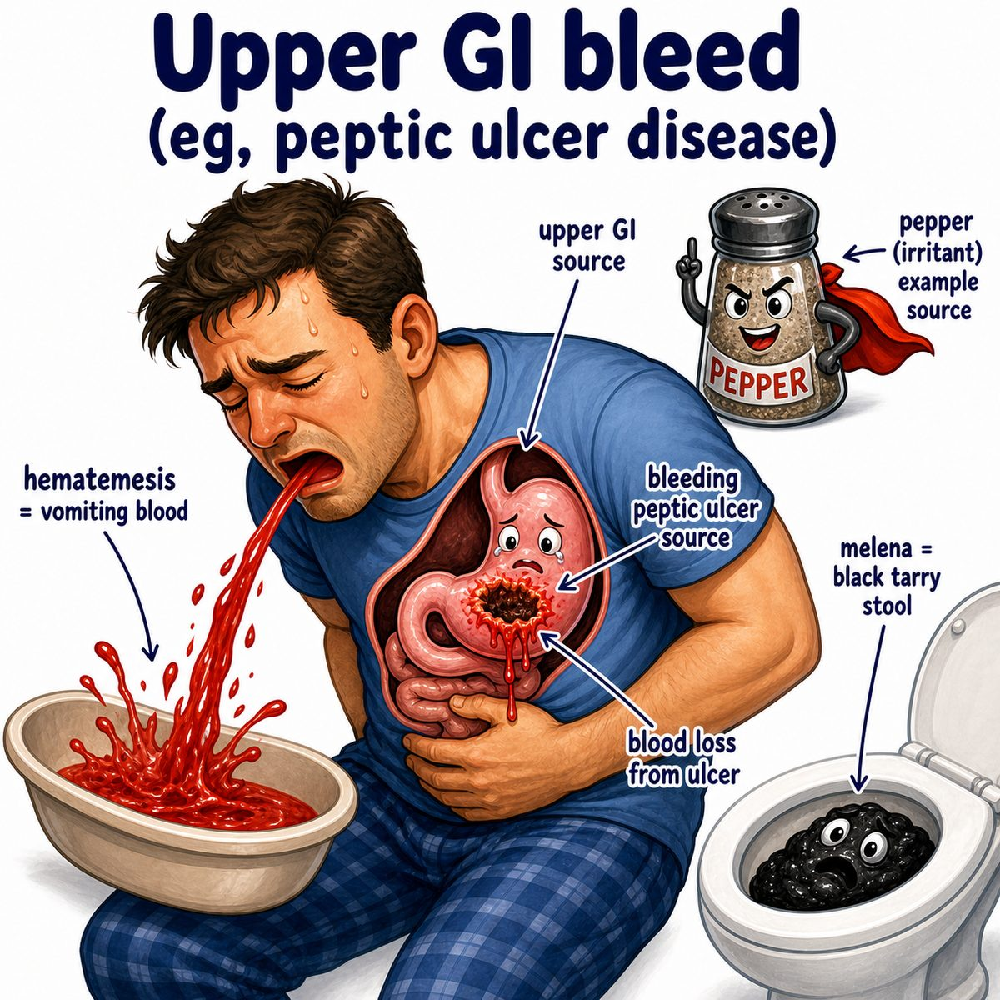

# Upper gastrointestinal bleeding

Upper gastrointestinal bleeding means bleeding from the upper GI tract (gastrointestinal tract), usually:

* esophagus
* stomach
* duodenum

Duodenum = first part of the small intestine.

Classically, the cutoff is bleeding **above the ligament of Treitz**.

---

### Main presentations

* **Hematemesis** = vomiting blood
* **Coffee-ground emesis** = vomiting dark, partially digested blood
* **Melena** = black, tarry stool from digested blood
* **Hematochezia** = bright red blood per rectum; usually lower GI, but can happen in a massive upper GI bleed

---

### Common causes

Big ones to know:

* peptic ulcer disease
* erosive gastritis
* esophageal varices
* Mallory-Weiss tear

Peptic ulcer disease = acid-related ulcer in stomach or duodenum.

Esophageal varices = dilated esophageal veins from portal hypertension (high pressure in the portal venous system, usually from cirrhosis).

Mallory-Weiss tear = mucosal tear near the gastroesophageal junction after forceful vomiting/retching.

---

### Why melena happens

Blood from the upper GI tract sits in acid and digestive enzymes.

So hemoglobin (oxygen-carrying protein in red blood cells) gets digested/oxidized, turning stool:

* black
* sticky
* foul-smelling

That is melena.

---

### Why BUN can increase

BUN (blood urea nitrogen) can rise in upper GI bleeding because swallowed blood is basically a protein meal.

Protein gets broken down into nitrogen, absorbed, then converted to urea by the liver.

So:

> upper GI blood gets digested -> more nitrogen absorbed -> increased BUN

This can give an increased BUN/creatinine ratio.

Creatinine = kidney filtration marker from muscle metabolism.

---

### First instinct clinically

If unstable, first stabilize:

* airway if needed
* IV fluids
* blood transfusion if severe
* then upper endoscopy

Upper endoscopy = camera through the mouth to look at esophagus, stomach, and duodenum.

It is both diagnostic and therapeutic because you can find the bleed and treat it.

---

## One-line intuition

Upper GI bleeding is blood leaking into the esophagus/stomach/duodenum, so it can come out as vomited blood or get digested into black tarry stool.

---

## Pearl 🔥

Upper GI bleed + cirrhosis signs = think **esophageal varices**; treat with octreotide (somatostatin analog that decreases portal blood flow) plus antibiotics, then endoscopic banding.