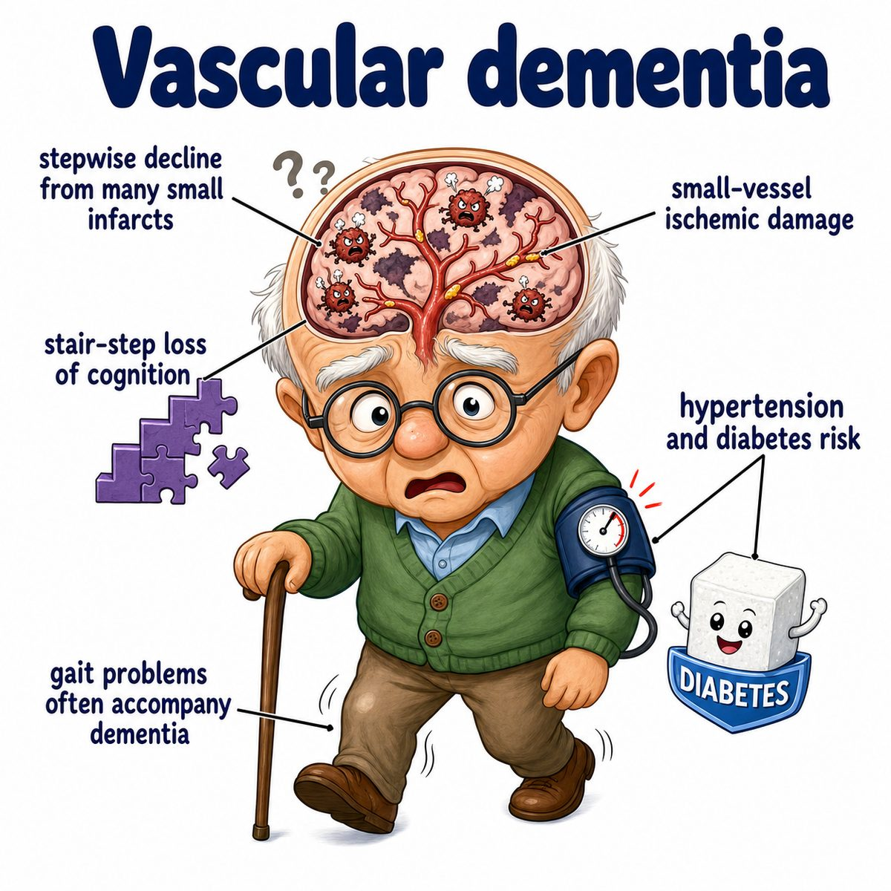

# Vascular dementia

### Core idea

Vascular dementia is dementia caused by poor blood flow to the brain.

Dementia means decline in cognition severe enough to interfere with daily life.

So the simple idea is:

> damaged brain blood vessels -> brain tissue injury -> problems with thinking, planning, memory, and behavior.

---

### Why it happens

The brain needs constant oxygen and glucose from blood.

If blood flow is reduced because of:

* stroke
* multiple small infarcts
* chronic small vessel disease
* hypertension
* diabetes mellitus
* atherosclerosis

then neurons get injured or die.

Infarct means tissue death from loss of blood supply.

---

### How it presents

Vascular dementia often has more executive dysfunction than pure memory loss.

Executive dysfunction means trouble with planning, organizing, attention, judgment, and problem-solving.

Common findings:

* slowed thinking
* poor attention
* impaired planning/judgment
* gait problems
* urinary symptoms
* mood changes
* focal neurologic deficits if from stroke

Focal neurologic deficits means localized brain findings like weakness, numbness, or speech problems.

---

### Key pattern

Classically, vascular dementia can decline in a stepwise pattern.

That means:

* stroke happens
* cognition suddenly worsens
* patient partially stabilizes
* another vascular event happens
* cognition drops again

So unlike Alzheimer disease, which is usually slow and steadily progressive, vascular dementia can look like drops after vascular injuries.

---

### Why memory may be less prominent

Alzheimer disease classically hits memory early because it affects the hippocampus, which is important for forming new memories.

Vascular dementia depends on where blood flow damage happens.

If damage hits frontal-subcortical circuits, the patient may mainly have:

* poor attention
* slow processing
* poor planning
* gait issues

Frontal-subcortical circuits means connections between the frontal lobe and deeper brain structures that help control planning, movement, and behavior.

---

## One-line intuition

Vascular dementia is basically repeated or chronic "mini-brain injuries" from poor blood flow, causing cognition to decline.

---

## Pearl 🔥

Vascular dementia is associated with vascular risk factors:

* hypertension
* diabetes mellitus
* smoking
* hyperlipidemia
* prior stroke or transient ischemic attack

Transient ischemic attack means temporary stroke-like symptoms from brief loss of blood flow without permanent infarction.