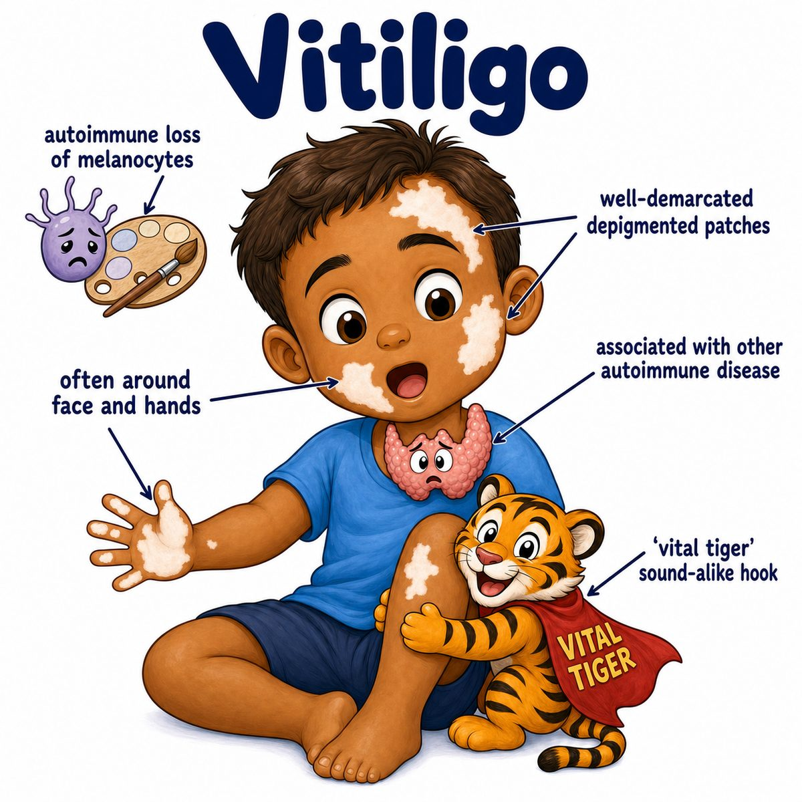

# Vitiligo

### Core idea

Vitiligo is an autoimmune loss of melanocytes (pigment-making skin cells).

Melanocytes normally make melanin (skin pigment), so when they are destroyed, you get:

* well-demarcated white patches
* normal skin texture
* no scale
* often symmetric involvement

---

### Why the skin turns white

Think:

* melanocyte = pigment factory
* melanin = pigment product
* autoimmune attack = factory destroyed

So vitiligo is not just "less pigment."

It is depigmentation, meaning loss of pigment because the melanocytes are gone or not functioning.

---

### Common locations

Often shows up on:

* face
* hands
* elbows/knees
* around body openings
* areas of trauma or friction

Trauma-triggered lesions are called the Koebner phenomenon (skin disease appearing at sites of injury).

---

### Associations

Vitiligo is associated with other autoimmune diseases, especially:

* autoimmune thyroid disease
* type 1 diabetes mellitus
* pernicious anemia (vitamin B12 deficiency from autoimmune loss of intrinsic factor)
* Addison disease (primary adrenal insufficiency)

---

## One-line intuition

The immune system attacks melanocytes, so those skin areas lose melanin and become sharply white.

---

## Pearl 🔥

HY Step 1: vitiligo is an autoimmune destruction of melanocytes, while albinism is a tyrosinase defect causing decreased melanin production with melanocytes still present.