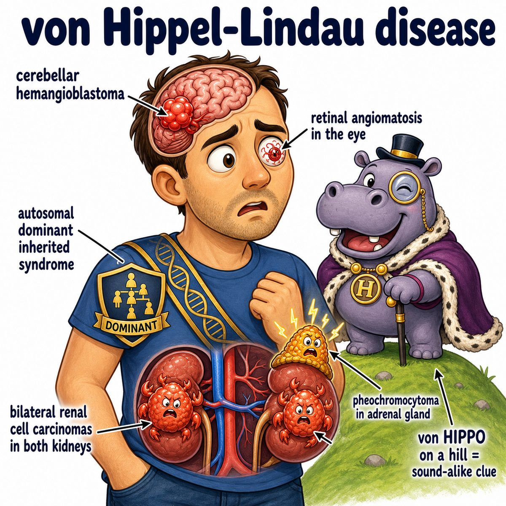

# von Hippel-Lindau disease

### Core idea

von Hippel-Lindau disease is an autosomal dominant tumor syndrome caused by mutation of the VHL gene on chromosome 3p.

VHL (von Hippel-Lindau gene) is a tumor suppressor gene.

So the basic idea is:

> broken tumor suppressor gene = lots of cysts and vascular tumors in multiple organs.

---

### Main tumors/lesions

Classically causes:

* hemangioblastomas (benign blood-vessel tumors) in the cerebellum, spinal cord, and retina
* clear cell RCC (renal cell carcinoma, a kidney cancer)
* pheochromocytoma (catecholamine-secreting adrenal medulla tumor)
* pancreatic cysts or pancreatic neuroendocrine tumors (hormone-producing pancreas tumors)
* endolymphatic sac tumors (inner ear tumors that can cause hearing problems)

---

### Why the findings happen

Normally, VHL protein helps destroy HIF (hypoxia-inducible factor), especially when oxygen is normal.

If VHL is mutated:

* HIF is not degraded
* HIF builds up
* HIF tells the body to act like it is hypoxic
* VEGF (vascular endothelial growth factor) increases
* lots of abnormal blood vessel growth happens

That is why VHL is strongly associated with hemangioblastomas.

Break down hemangioblastoma:

* hemangio- = blood vessel
* blastoma = tumor from primitive cells

So:

> a vascular tumor, especially in the retina and central nervous system.

---

### Classic Step 1 pattern

Think VHL when you see:

* young patient
* cerebellar or retinal hemangioblastoma
* kidney cysts or clear cell RCC
* possible pheochromocytoma
* autosomal dominant inheritance

---

## One-line intuition

VHL normally puts the brakes on hypoxia signaling; when VHL is gone, HIF stays on, VEGF rises, and vascular tumors/cysts form everywhere.

---

## Pearl

VHL is a tumor suppressor disease, so tumors usually follow the two-hit hypothesis: one bad copy is inherited, then the second copy is lost in affected tissue.