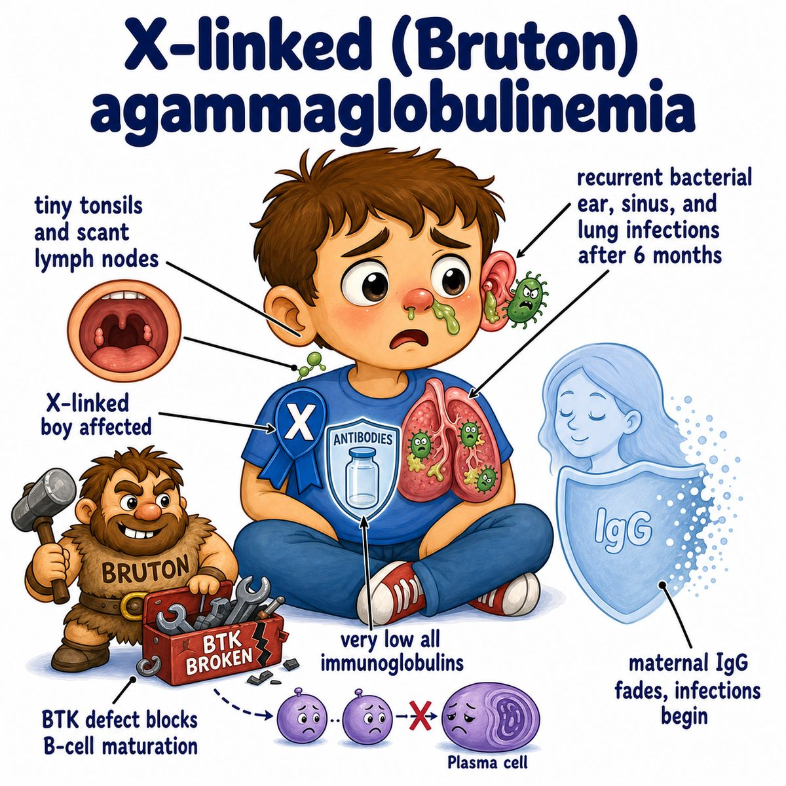
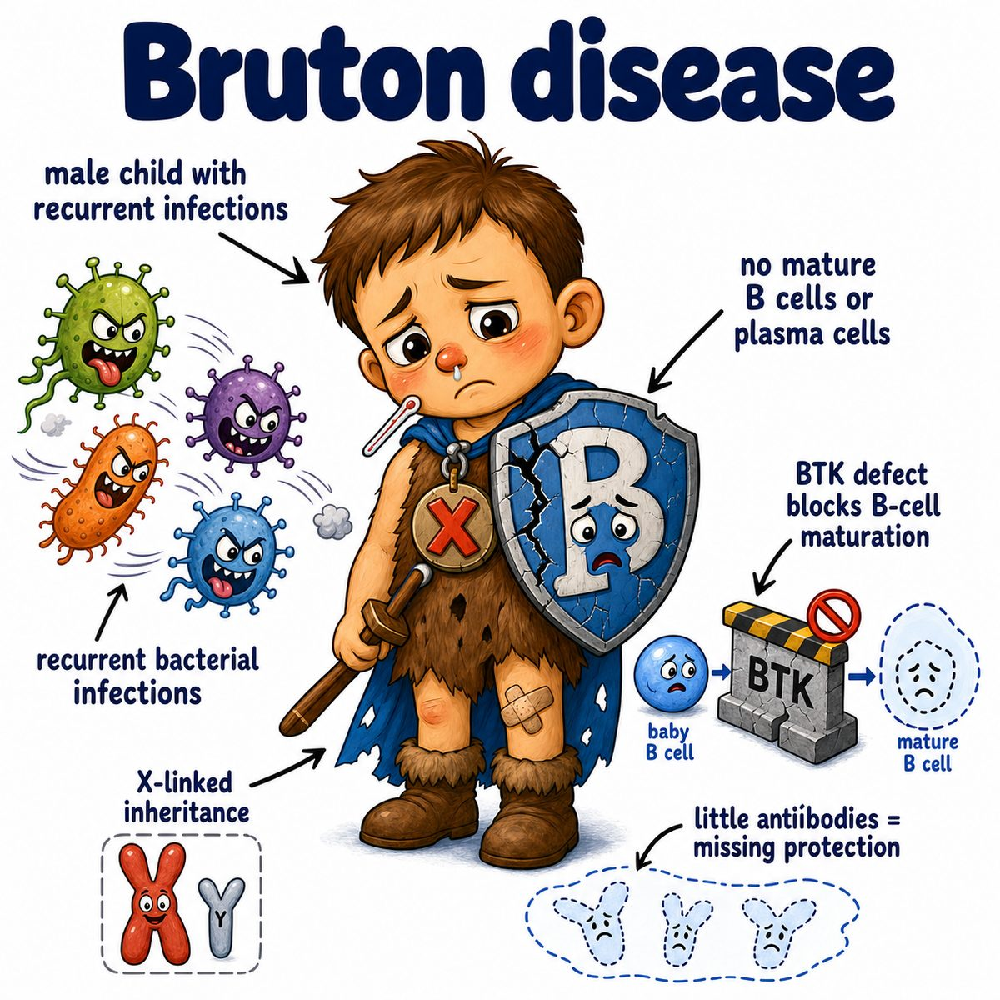

# X-linked agammaglobulinemia

X-linked agammaglobulinemia is a primary immunodeficiency (inborn immune system problem) where B cells fail to mature.

Cause:

* mutation in BTK (Bruton tyrosine kinase)
* X-linked recessive inheritance
* classically affects boys

Break the name apart:

* X-linked = gene is on the X chromosome
* a- = absent/very low
* gamma globulin = immunoglobulin/antibody proteins
* -emia = in the blood

So:

> very low antibodies in the blood because B cells cannot mature.

---

### Core idea

BTK (Bruton tyrosine kinase) is needed for B-cell maturation.

Normally:

* stem cell
* pro-B cell
* pre-B cell
* immature B cell
* mature B cell
* plasma cell
* antibodies

In X-linked agammaglobulinemia:

* B cells get stuck early
* mature B cells are absent/low
* plasma cells are absent/low
* all immunoglobulins are low

Immunoglobulins (antibodies) include:

* IgG (immunoglobulin G)
* IgA (immunoglobulin A)
* IgM (immunoglobulin M)
* IgE (immunoglobulin E)
* IgD (immunoglobulin D)

---

### Why infections start after 6 months

Newborns have maternal IgG (immunoglobulin G) from the placenta.

That maternal antibody protects the baby for the first few months.

Around 6 months, maternal IgG drops.

Then the baby needs his own B cells to make antibodies, but he cannot.

So you see:

* recurrent ear infections
* recurrent sinus infections
* recurrent pneumonia
* recurrent bacterial infections

---

### Why encapsulated bacteria are a big deal

Encapsulated bacteria have a capsule (slimy outer coat) that makes them hard for phagocytes (cells that eat microbes) to grab.

Antibodies normally coat them.

That coating is called opsonization (marking a microbe so immune cells can eat it).

In X-linked agammaglobulinemia:

* low antibodies
* poor opsonization
* poor clearance of encapsulated bacteria

Classic encapsulated organisms:

* Streptococcus pneumoniae
* Haemophilus influenzae
* Neisseria meningitidis

---

### Exam clues

Think X-linked agammaglobulinemia when you see:

* boy
* recurrent bacterial infections after 6 months
* absent tonsils/lymph nodes
* very low immunoglobulins
* very low B cells
* normal T cells

T cells are normal because the main problem is B-cell maturation.

---

## One-line intuition

The baby loses mom's antibodies around 6 months, but his own B cells cannot mature, so he cannot make antibodies against bacteria.

---

## Pearl 🔥

X-linked agammaglobulinemia = BTK mutation with low B cells and low all immunoglobulins.

Contrast with CVID (common variable immunodeficiency): B cells are usually present, but they do not become good antibody-secreting plasma cells.